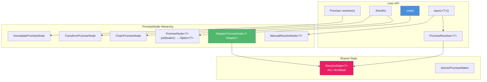

# Promise\<T\> — Composable Deferred Values

[← libxpp](../README.md)

## Introduction

`Promise<T>` provides a type-safe async programming system within the libx event loop. It models the Rust `Future` trait in C++17: a deferred value is polled until it resolves, transformations are chained without nesting, and resolution can cross thread boundaries without a mutex.

No separate runtime is needed — `wait()` drives the event loop directly.

```cpp
xpp::EventLoop loop;
xpp::WaitScope scope(loop);

int result = xpp::Promise<int>::resolve(10)
    .then([](int x) { return x * 2; })
    .wait();
// result == 20
```

## Design Philosophy

1. **One-Shot Polling** — `poll()` returns `Option<T>`: `Some(value)` = ready, `None` = pending. No separate `take()`.
2. **No Executor** — No scheduler, no reactor. Only `wait()` → `xEventLoopRun`.
3. **Auto-Flatten** — `.then(fn)` returning `Promise<U>` becomes `Promise<U>`, not `Promise<Promise<U>>`.
4. **Lock-Free Cross-Thread Resolve** — `PromiseResolver` holds `ArcWeak`; `resolve()` silently drops if Promise is destroyed.
5. **Void-Aware Templates** — `Void` + `FixVoid<T>` maps `void → Void` for uniform generic code.
6. **Nested `wait()` Is Safe** — `WaitScope` owns the loop binding; nested `Run` calls don't unbind it.

## Architecture



## Topics

- [Deferred Resolution](deferred.md) — `async()`, `PromiseResolver`, cross-thread resolve
- [Timers & Timeouts](timers.md) — `after(ms)`, timeout pattern with `race`
- [Combinators](combinators.md) — `all()`, `race()`, concurrent composition
- [Custom Adapters](adapter.md) — `Promise::adapt`, `Promise::work`, Adapter contract, `TimerAdapter`, `WorkAdapter`
- [C++20 Coroutines](coroutine.md) — `co_await` / `co_return` with `Promise<T>` (no `Task<T>`)
- [Internals](internals.md) — `PromiseNode` hierarchy, waker system, `ResolveState`

## API Reference

### Promise\<T\>

| Member | Description |
| -------- | ------------- |
| `static Promise resolve(T v)` | Immediately-resolved promise |
| `auto then(Func fn)` | Chain transform (auto-flattens) |
| `Promise<void> discard()` | Drop value, return `Promise<void>` |
| `T wait()` | Block + drive event loop. Consumes promise |
| `static auto defer(Func fn)` | Defer sync function as promise |
| `static Promise<void> after(uint64_t ms)` | (void only) Resolve after delay |
| `static Promise<T> work(Func fn)` | Run func on thread pool, resolve with result |
| `operator co_await()` | (C++20 only) Await in coroutine. Rvalue-qualified |
| `operator bool()` | True if non-empty |

### PromiseResolver\<T\>

| Member | Description |
| -------- | ------------- |
| `void resolve(T v)` | Fulfill. Thread-safe. Silently drops if Promise destroyed |
| `bool is_pending()` | True if Promise alive and unresolved |

### Free Functions

| Function | Description |
| ---------- | ------------- |
| `async<T>()` | → `pair<Promise<T>, PromiseResolver<T>>` |
| `Promise<T>::adapt<Adapter>(args...)` | Custom adapter-backed promise |
| `all(Promise<Ts>...)` | Wait for all → `tuple` or `void` |
| `race(Promise<T>, Promise<T>...)` | First resolved wins |
| `yield()` | Immediately-resolved `Promise<void>` |
