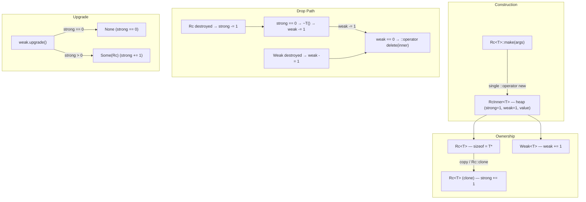

# rc.h / weak.h — Single-Threaded Reference Counting

## Introduction

`rc.h` provides `Rc<T>`, a non-null shared-owning reference-counted handle to a heap-allocated `T`. `weak.h` provides `Weak<T>`, a non-owning observer that does not keep `T` alive. Together they form a single-threaded ownership system with explicit cycle-breaking — the same design as Rust's `std::rc::Rc<T>` + `std::rc::Weak<T>`.

Key properties:

| Property | Value |
|---|---|
| `sizeof(Rc<T>)` | `sizeof(T*)` |
| `sizeof(Option<Rc<T>>)` | `sizeof(T*)` (niche: nullptr = None) |
| `sizeof(Weak<T>)` | `sizeof(T*)` |
| Allocation | 1× per `make()` (inner block = counts + T) |
| Thread safety | Single-thread only (use `Arc<T>` for cross-thread) |

Rc is **co-located but NOT intrusive**: `T` does not need to inherit from anything. A single `Rc<T>::make(args...)` call allocates an `RcInner<T>` block that carries the strong count, weak count, and the value side by side — warm cache lines and one `free` when the last observer leaves.

## Architecture



### Reference-Count Layout (matches Rust)

```
strong = number of Rc<T> handles
weak   = number of Weak<T> handles + 1  (the +1 represents "the set of all live Rcs")
```

When the last Rc drops:
1. `strong` hits 0 → destroy `T` in place
2. Decrement `weak` (this is the "+1 for all strongs" unwinding)
3. If `weak` now hits 0 → free the inner block

This two-stage teardown means `Weak::upgrade()` can safely read `strong` even after every visible Rc is gone — the inner memory outlives `T`.

## API Reference

### Rc\<T\>

| Category | Signature | Description |
|---|---|---|
| **Construct** | `Rc<T>::make(args...)` | Single allocation: inner + T. strong=1, weak=1. |
| **Copy** | `Rc(const Rc&)` | +1 strong (implicit on copy) |
| **Move** | `Rc(Rc&&)` | Zero count change; source invalidated |
| **Covariant copy** | `Rc<Base>(const Rc<Derived>&)` | Same inner, +1 strong |
| **Covariant move** | `Rc<Base>(Rc<Derived>&&)` | Same inner, no count change |
| **Clone (member)** | `r.clone()` | Explicit +1, returns new Rc |
| **Clone (static)** | `Rc<T>::clone(&r)` | Rust-style explicit +1 |
| **Downgrade** | `Rc<T>::downgrade(&r)` → `Weak<T>` | Creates observer; `weak += 1` |
| **Deref** | `*r`, `r->field`, `r.get()` → `T&`, `T*` | Direct access through the inner |
| **Counts** | `r.strong_count()`, `r.weak_count()` | Debug/instrumentation (do not branch on) |
| **Swap** | `r.swap(other)`, `swap(r1, r2)` | Exchange inners |

`Rc<T>` has **no default constructor** — it is always non-null when valid.

### Weak\<T\>

| Category | Signature | Description |
|---|---|---|
| **Default** | `Weak()` | Null weak (no inner observed) |
| **From Rc** | `Weak(const Rc<T>&)` | Observe; `weak += 1` |
| **Copy / Move** | standard | Copy bumps weak; move doesn't |
| **Upgrade** | `w.upgrade()` → `Option<Rc<T>>` | Some if strong>0, else None |
| **Counts** | `w.strong_count()`, `w.weak_count()` | Debug only |
| **Expired** | `w.is_expired()` | True if strong==0 or null |
| **Swap** | `w.swap(other)`, `swap(w1, w2)` | Exchange inners |

### Option\<Rc\<T\>\> Specialization

A full specialization of `Option<Rc<T>>` at `sizeof(T*)` via the niche (nullptr = None):

| Category | Signature | Description |
|---|---|---|
| **From Rc** | `Option(const Rc<T>&)`, `Option(Rc<T>&&)` | Some, +1 strong or move |
| **Unwrap** | `opt.unwrap()` → `Rc<T>` (rvalue) | Takes ownership; panics on None |
| **Take** | `opt.take()` → `Rc<T>` | Moves value out, leaves None |
| **Check** | `is_some()`, `is_none()`, `operator bool` | Standard Option interface |

## Usage Examples

### Basic lifecycle

```cpp
auto r1 = Rc<std::string>::make("hello");
EXPECT_EQ(r1.strong_count(), 1);

{
    auto r2 = r1;                    // copy — strong += 1
    EXPECT_EQ(r1.strong_count(), 2);
    EXPECT_EQ(*r2, "hello");
}                                    // r2 dropped — strong -= 1

EXPECT_EQ(r1.strong_count(), 1);
```

### Covariant upcast

```cpp
struct Base { virtual ~Base() = default; };
struct Derived : Base {};

Rc<Derived> derived = Rc<Derived>::make();
Rc<Base>    base    = derived;                    // implicit covariant copy
// Both point at the same inner, strong == 2.
```

### Option\<Rc\<T\>\> niche

```cpp
Option<Rc<int>> opt = Rc<int>::make(42);          // Some
EXPECT_TRUE(opt.is_some());

Rc<int> taken = std::move(opt).unwrap();          // Move out
EXPECT_TRUE(opt.is_none());                       // Niche preserved

static_assert(sizeof(Option<Rc<int>>) == sizeof(int*), "niche check");
```

### Tree with cycle-free back-edges (Rc + Weak)

```cpp
struct Node {
    Weak<Node>              parent;               // weak — does NOT keep parent alive
    std::vector<Rc<Node>>   children;             // strong — owns children
};

Rc<Node> root  = Rc<Node>::make();
Rc<Node> child = Rc<Node>::make();

root->children.push_back(child.clone());
child->parent = Rc<Node>::downgrade(root);        // weak += 1, strong unchanged

// Walk up:
if (auto p = child->parent.upgrade()) {
    p.unwrap()->...                               // parent still alive
}

// When root goes out of scope:
//   root's strong → 0 → T destroyed
//   root's vector destroyed → child Rc dropped
//   child's strong → 0 → T destroyed → Weak::parent dtor → weak -= 1
//   weak → 0 → inner freed
// No leak. ✓
```

### Observer pattern

```cpp
class Subject {
    std::vector<Weak<Observer>> m_observers;       // weak — doesn't own

public:
    void attach(const Rc<Observer>& obs) {
        m_observers.push_back(Weak<Observer>(obs));
    }

    void notify() {
        for (auto& w : m_observers) {
            if (auto obs = w.upgrade()) {
                obs.unwrap()->on_event();
            }
            // expired entries naturally skipped; lazy cleanup possible
        }
    }
};
```

## Comparison

| Feature | xpp::Rc\<T\> | std::shared_ptr\<T\> | Rust Rc\<T\> |
|---|---|---|---|
| sizeof | `sizeof(T*)` | 2× ptr (ptr + ctrl) | `sizeof(T*)` |
| Allocation | 1× per make | Constructor from ptr: 2×; make_shared: 1× | 1× per Rc::new |
| Thread-safe | No (plain size_t) | Yes (atomic) | No |
| Non-null by default | Yes (no default ctor) | No (default → null) | Yes (Rc::new → non-null) |
| Niche Option | Yes (Option<Rc<T>> = ptr) | No | Yes (Option<Rc<T>> = ptr) |
| Weak observer | Weak<T> | weak_ptr<T> | Weak<T> |
| Cycle-breaking | Explicit via Weak | Explicit via weak_ptr | Explicit via Weak |
| Custom deleter | No | Yes | No |
| Covariant | `Rc<Derived>` → `Rc<Base>` (implicit) | aliasing ctor (explicit) | Via trait objects only |

## Implementation Notes

### Inner block layout

```cpp
template <class T> struct RcInner {
    size_t strong;   // number of Rc<T> handles
    size_t weak;     // number of Weak<T> + 1 (the +1 represents all live Rcs)
    T      value;    // co-located — warm cache
};
```

Single `::operator new(sizeof(RcInner<T>))`, zero external control block. Used by both `Rc<T>` and `Weak<T>` sharing the same pointer.

### Two-stage destruction

```
Rc drop path:
  rc_dec_strong(inner):
    if --strong == 0:
      inner->value.~T()                    // ① destroy T
      rc_dec_weak_and_maybe_dealloc(inner) // ② drop the "+1 for all strongs"
      
Weak drop path:
  rc_dec_weak_and_maybe_dealloc(inner):
    if --weak == 0:
      ::operator delete(inner)             // ③ free inner block
```

Steps ② and ③ are the same function. When no Weak ever existed, `weak` goes from 1→0 in the same call as ②, so the inner is freed immediately — no dangling empty block.

### weak_count convention

`Rc::weak_count()` returns `inner->weak - 1` — excludes the implicit +1. When only Rcs exist (no Weak), this reads 0, matching Rust's `Rc::weak_count()`. `Weak::weak_count()` uses the same formula when `strong > 0`, otherwise returns `inner->weak` (the +1 was already unwound when the last Rc dropped).

### Option\<Rc\<T\>\> niche

The specialization stores a raw `RcInner<T>*` directly, with `nullptr` encoding `None`. Both `Option<Rc<T>>` and `Rc<T>` are `friend class` of each other so the specialization can access the private raw-pointer constructor and the `unwrap()` fast path avoids double-counting.

### Why "Rc" not "Ref"

`Ref` is overloaded across C++ libraries (WebKit's `WTF::Ref` is intrusive; Qt's `QRef` is different again). The `Rc` spelling makes it unambiguous that this follows Rust's non-intrusive, co-located design — recognizable even without reading the header.
