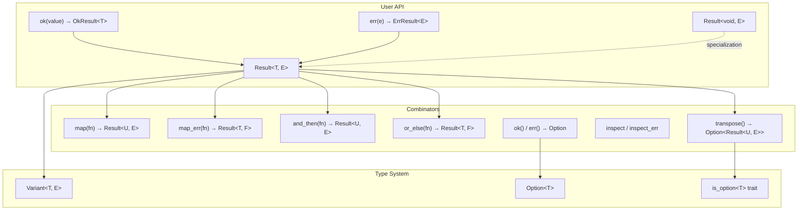

# result.h — Value or Error

## Introduction

`result.h` provides `Result<T, E>`, a type that holds exactly one of: a success value `T` or an error `E`. It is the libxpp counterpart of Rust's `Result` and C++23's `std::expected`.

No empty state. A `Result` is always either `Ok` or `Err`. Accessing the wrong variant panics. The tag dispatch `ok(value)` / `err(e)` mirrors Rust's `Ok(x)` / `Err(e)` idiom for ergonomic construction.

A partial specialization `Result<void, E>` handles operations that succeed with no value (only an error can be produced).

## Design Philosophy

1. **Always holds something.** No default constructor, no null state. A `Result` must be initialized with `Ok` or `Err`.

2. **Three unwrap trust levels.** `unwrap()` always checks (release too), `unwrap_unchecked()` only in debug, `operator*()` / `operator->()` never check — identical to `Option`'s pattern.

3. **Combinators mirror Rust.** `map`, `map_err`, `and_then`, `or_else`, `unwrap_or_else`, `inspect`, `inspect_err`, `transpose` — all with the same semantics and rvalue-qualified consuming overloads.

4. **Void success via specialization.** `Result<void, E>` avoids the `OkSentinel` dance: a zero-size tag type marks the Ok variant, `operator*` and `operator->` are removed, and combinators accept zero-arg functions.

5. **`Option` <-> `Result` bridge.** `Option::ok_or(e)` → `Result<T, E>`, `Result::ok()` → `Option<T>`, `Result::err()` → `Option<E>`, `Result::transpose()` → `Option<Result<U, E>>` when `T = Option<U>`.

## Architecture



## API Reference

### Tags and Factory Functions

| Expression | Result |
|---|---|
| `Result<T, E>(ok, value)` | Ok with `value` |
| `Result<T, E>(err, error)` | Err with `error` |
| `ok(value)` or `err(e)` | Implicit conversion carrier |
| `Result<void, E>(ok)` | Void success |
| `Result<void, E>(err, error)` | Void error |

### Observers

| Method | Returns | Panics if |
|---|---|---|
| `is_ok()` | `bool` | Never |
| `is_err()` | `bool` | Never |
| `operator bool()` | `bool` (explicit) | Never |

### Unwrap (checked)

| Method | Returns | Panics if |
|---|---|---|
| `unwrap()` | `T&` / `const T&` / `T&&` | `is_err()` |
| `unwrap_err()` | `E&` / `const E&` / `E&&` | `is_ok()` |
| `expect(msg)` | `T&` (with custom message) | `is_err()` |
| `expect_err(msg)` | `E&` (with custom message) | `is_ok()` |

### Unwrap (unchecked — debug assert only)

| Method | Returns |
|---|---|
| `unwrap_unchecked()` | `T&` |
| `unwrap_err_unchecked()` | `E&` |

### Convenience

| Method | Returns | Notes |
|---|---|---|
| `unwrap_or(fallback)` | `const T&` / `T` | Fallback if Err |
| `unwrap_or_else(fn)` | `T` (consuming, rvalue only) | Lazy fallback |
| `operator*()` | `T&` | UB if `is_err()` |
| `operator->()` | `T*` | UB if `is_err()` |

### Combinators

| Method | Signature | Description |
|---|---|---|
| `map(fn)` | `Result<T, E> → Result<U, E>` | Transform Ok value |
| `map_err(fn)` | `Result<T, E> → Result<T, F>` | Transform Err value |
| `and_then(fn)` | `Result<T, E> → Result<U, E>` | Monadic bind: fn(value) → Result |
| `or_else(fn)` | `Result<T, E> → Result<T, F>` | Recover: fn(err) → Result |
| `inspect(fn)` | Chainable side-effect on Ok |
| `inspect_err(fn)` | Chainable side-effect on Err |
| `transpose()` | `Result<Option<U>, E> → Option<Result<U, E>>` | Swap layers |

### Conversion to Option

| Method | Returns | Notes |
|---|---|---|
| `ok()` | `Option<T>` (consuming) | Some(value) if Ok, None if Err |
| `err()` | `Option<E>` (consuming) | Some(error) if Err, None if Ok |

### Result\<void, E\> Members

| Member | Notes |
|---|---|
| `Result<void, E>(ok)` | Success, no value |
| `Result<void, E>(err, e)` | Error |
| `is_ok()` / `is_err()` | Same as `Result<T, E>` |
| `unwrap_err()` | Returns `E&` |
| `map_err(fn)` | Transform error type |
| `and_then(fn)` | fn() → `Result<U, E>` |
| `or_else(fn)` | fn(err) → `Result<void, F>` |
| `inspect_err(fn)` | Chainable Err inspection |

## Usage Examples

### Basic Ok / Err

```cpp
xpp::Result<int, std::string> r(xpp::ok, 42);
if (r.is_ok()) {
    int val = r.unwrap();  // 42
}

xpp::Result<int, std::string> fail(xpp::err, std::string("not found"));
// fail.unwrap();  // panics: "unwrap() on Err Result"
```

### ok() / err() factory functions

```cpp
auto r = xpp::ok(42);   // carrier, converts to Result<T, E>
auto e = xpp::err("nope");

xpp::Result<int, const char*> success = xpp::ok(42);
xpp::Result<int, const char*> failure = xpp::err("nope");
```

### map + and_then chains

```cpp
auto result = parse_number("42")
    .map([](int x) { return x * 2; })          // 42 → 84
    .and_then([](int x) {
        if (x > 100) return xpp::ok(x / 2);    // 84 → 42
        return xpp::err("too small");           // short-circuit
    });
```

### map_err and or_else

```cpp
auto result = load_config()
    .map_err([](auto e) { return "config error: " + e; })  // enrich error
    .or_else([](auto e) {
        log_error(e);
        return load_default_config();  // fallback
    });
```

### Void result (operation with no value)

```cpp
xpp::Result<void, xErrno> write_result = write_to_file(path, data);
if (write_result.is_ok()) {
    // success — no unwrap() needed
} else {
    xErrno e = write_result.unwrap_err();
}

// Chain: only proceed if write succeeded
write_result
    .and_then([] { return flush_file(); })
    .inspect_err([](xErrno e) { log("write failed: %d", e); });
```

### Transpose: swap Result<Option<T>, E>

```cpp
// lookup() returns Option<int> wrapped in Result: Result<Option<int>, E>
auto found = xpp::ok(xpp::Some(42));  // Result<Option<int>, E>
auto transposed = std::move(found).transpose();  // Option<Result<int, E>>
// transposed == Some(Ok(42))

auto not_found = xpp::ok(xpp::Option<int>(xpp::none));
auto transposed2 = std::move(not_found).transpose();
// transposed2 == None (no error, just no value)
```

## Comparison

| | `xpp::Result<T, E>` | Rust `Result<T, E>` | C++23 `std::expected<T, E>` |
|---|---|---|---|
| Empty state | None | None | None |
| `unwrap()` panics | Always (release too) | Always | Throws `bad_expected_access` |
| `ok()` / `err()` factory | `ok(v)` / `err(e)` | `Ok(v)` / `Err(e)` | `std::unexpected(e)` |
| `map_err` | Yes | `Result::map_err` | `expected::transform_error` |
| Combinator set | Full (and_then, or_else, etc.) | Full | Partial (and_then, or_else, transform) |
| `transpose()` | Yes | Yes | No |
| Void specialization | Yes (`Result<void, E>`) | Yes (`Result<(), E>`) | Yes (`expected<void, E>`) |
| C++ standard | C++11 | — | C++23 |

## Implementation Notes

### Storage: Variant\<T, E\>

```cpp
template <class T, typename E>
class Result {
    Variant<T, E> m_data;
};
```

`Result` delegates all storage and destruction to `Variant<T, E>`. The Ok variant is index 0, Err is index 1. `is_ok()` is `m_data.index() == 0`.

### Void Specialization

```cpp
template <class E>
class Result<void, E> {
    Variant<OkSentinel, E> m_data;
};
```

`OkSentinel` is a zero-size tag struct. The `Variant<OkSentinel, E>` stores `OkSentinel` at index 0 and `E` at index 1 — no storage overhead for the success case. `is_ok()` checks `m_data.is<OkSentinel>()` (index 0), `is_err()` checks `m_data.is<E>()` (index 1).

### Option Bridge: ok_or / ok_or_else

The definitions live in `result.h` (not `option.h`) because they depend on `Result<T, E>` being complete:

```cpp
template <class T> template <class E>
Result<T, E> Option<T>::ok_or(E e) && {
    return m_has_value ? Result<T, E>(ok, std::move(unwrap_unchecked()))
                      : Result<T, E>(err, std::move(e));
}
```

`Option` forward-declares `Result`, and the out-of-line definitions after `Result`'s class body link the two. This avoids a circular header dependency.
