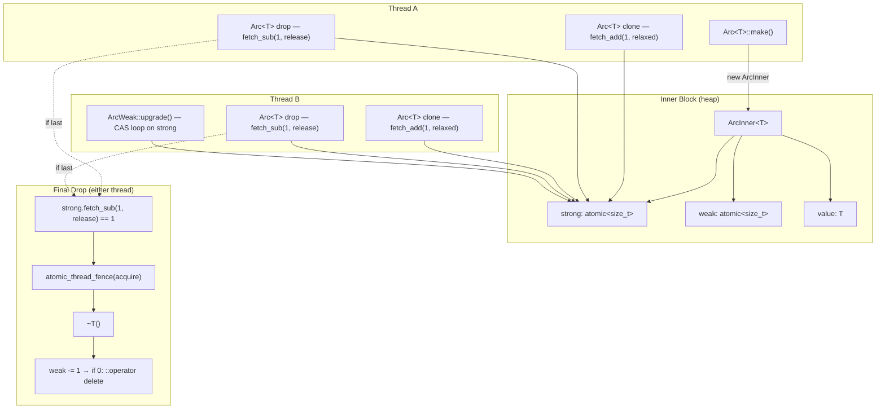

# arc.h — Atomic Reference Counting (Thread-Safe)

## Introduction

`arc.h` provides `Arc<T, Allocator>`, the thread-safe atomic counterpart of `Rc<T, Allocator>`. It also provides `ArcWeak<T, Allocator>`, a cross-thread-safe non-owning observer. Together they form the same ownership model as `Rc`/`Weak` but with `std::atomic<size_t>` counts and carefully chosen memory ordering — matching Rust's `std::sync::Arc<T, Allocator>` + `std::sync::Weak<T, Allocator>`.

Key properties:

| Property | Value |
| --- | --- |
| `sizeof(Arc<T, Allocator>)` | `sizeof(T*)` (any `A` — Allocator lives in ArcInner, not Arc) |
| `sizeof(Option<Arc<T, Allocator>>)` | `sizeof(T*)` (niche: nullptr = None) |
| `sizeof(ArcWeak<T, Allocator>)` | `sizeof(T*)` |
| Allocation | 1× per `make()` |
| Thread safety | Yes — clone/drop/upgrade safe across threads |
| Overhead vs Rc | ~3–5× on contended core; free on uncontended cache |
| Default Allocator | `GlobalAllocator` (empty → EBO → zero overhead) |

## Design Philosophy

1. **Same shape as Rc.** `Arc<T>` mirrors `Rc<T>` in API and layout. The only difference is `std::atomic<size_t>` instead of plain `size_t`, plus the atomic operations with the memory order discipline below.

2. **Proven memory order.** The acquire/release pattern is the same one used by Rust's libstd, `triomphe`, and `boost::atomic_shared_ptr` — battle-tested across millions of crates and deployments.

3. **Fence-on-drop, not fence-everywhere.** Clone uses `memory_order_relaxed` (no synchronisation needed for mere ownership transfer). Only the thread that actually destroys `T` or frees the inner pays the `acquire` fence cost. All other threads pay only `fetch_add`/`fetch_sub` — the cheapest atomic RMW the hardware offers.

4. **CAS upgrade.** `ArcWeak::upgrade()` uses a compare-exchange loop rather than a check-then-increment (which would race with another thread's drop). This is the canonical lock-free pattern for weak-to-strong conversion.

5. **Choose Arc only when needed.** If ownership never crosses threads, use `Rc<T>`. Arc's atomic operations are ~3–5× slower on contended cores. The type system doesn't enforce this choice — it's a documentation and review discipline.

## Architecture



### Memory Order Discipline

| Operation | Ordering | Rationale |
| --- | --- | --- |
| `strong.fetch_add(1)` (clone) | `relaxed` | No synchronisation; ownership alone carries no happens-before |
| `strong.fetch_sub(1)` (drop) | `release` | All previous writes to `T` must be visible to the destroying thread |
| When `strong` hits 0 | `atomic_thread_fence(acquire)` | Pair with every prior owner's release so `~T()` sees all writes |
| `weak.fetch_add(1)` (clone) | `relaxed` | Same as strong clone |
| `weak.fetch_sub(1)` (drop) | `release` | Pair with acquire fence in deallocator |
| When `weak` hits 0 | `atomic_thread_fence(acquire)` | Pair with every prior weak drop |
| `ArcWeak::upgrade()` CAS | `acquire` on success, `relaxed` on failure | Success must sync with prior strong drops |

## API Reference

### Arc\<T\>

Identical API to `Rc<T>` — all operations are atomic under the hood.

| Category | Signature | Description |
| --- | --- | --- |
| **Construct** | `Arc<T, Allocator>::make(args...)` | Single allocation. strong=1, weak=1. SFINAE: if first arg is convertible to `A`, treats it as the alloc instance. |
| **Construct (explicit)** | `Arc<T, Allocator>::make_in(alloc, args...)` | Explicit allocator — no SFINAE. Use when `make` is ambiguous. |
| **Copy** | `Arc(const Arc&)` | +1 strong (relaxed) |
| **Move** | `Arc(Arc&&)` | Zero count change; source invalidated |
| **Covariant** | `Arc<Base, A>(const Arc<Derived, A>&)` | Same inner, +1 strong. Same `A` required. |
| **Clone** | `a.clone()`, `Arc<T, Allocator>::clone(&a)` | Explicit +1 |
| **Downgrade** | `Arc<T, Allocator>::downgrade(&a)` → `ArcWeak<T, Allocator>` | +1 weak, strong unchanged |
| **Deref** | `*a`, `a->field`, `a.get()` → `T&`, `T*` | Access through inner |
| **Counts** | `a.strong_count()`, `a.weak_count()` | Relaxed loads (do not branch on) |
| **Swap** | `a.swap(other)`, `swap(a1, a2)` | Exchange inners |

### ArcWeak\<T\>

| Category | Signature | Description |
| --- | --- | --- |
| **Default** | `ArcWeak()` | Null observer |
| **From Arc** | `ArcWeak(const Arc<T>&)` | +1 weak (relaxed) |
| **Copy / Move** | standard | Copy bumps weak; move doesn't |
| **Upgrade** | `w.upgrade()` → `Option<Arc<T>>` | CAS loop. Some if strong>0, else None |
| **Counts** | `w.strong_count()`, `w.weak_count()` | Relaxed loads (debug only) |
| **Expired** | `w.is_expired()` | True if strong==0 or null |
| **Swap** | `w.swap(other)`, `swap(w1, w2)` | Exchange inners |

### Option\<Arc\<T\>\> Specialization

Same niche optimization as `Option<Rc<T>>`: `nullptr` = `None`, `sizeof == sizeof(T*)`.

| Category | Signature | Description |
| --- | --- | --- |
| **From Arc** | `Option(const Arc<T>&)`, `Option(Arc<T>&&)` | Some, +1 strong or move |
| **Unwrap** | `opt.unwrap()` → `Arc<T>` (rvalue) | Takes ownership; panics on None |
| **Take** | `opt.take()` → `Arc<T>` | Moves value out, leaves None |

## Usage Examples

### Cross-thread ownership

```cpp
auto shared = Arc<std::string>::make("hello");

std::thread t([shared]() {               // copy — strong += 1 (relaxed)
    EXPECT_EQ(*shared, "hello");
    // shared dropped here — strong -= 1 (release)
});

t.join();
EXPECT_EQ(shared.strong_count(), 1);     // only the outer handle remains
```

### Publisher-subscriber with ArcWeak (the canonical use)

```cpp
struct Subscriber {
    virtual void on_event(const std::string&) = 0;
};

class Publisher {
    std::mutex                     m_lock;
    std::vector<ArcWeak<Subscriber>> m_subs;

public:
    void subscribe(const Arc<Subscriber>& s) {
        std::lock_guard lk(m_lock);
        m_subs.push_back(Arc<Subscriber>::downgrade(s));
    }

    void publish(const std::string& event) {
        std::lock_guard lk(m_lock);
        auto write = m_subs.begin();
        for (auto& w : m_subs) {
            if (auto s = w.upgrade()) {
                s.unwrap()->on_event(event);     // safe — own a strong ref
                *write++ = std::move(w);
            }
            // else: subscriber already dropped — skip and compact
        }
        m_subs.erase(write, m_subs.end());
    }
};
```

### ArcWeak::upgrade races correctly

```cpp
// Thread A                               // Thread B
auto s = Arc<int>::make(42);              
auto w = Arc<int>::downgrade(s);
                                          // last Arc drops here:
                                          //   strong goes 1→0 → ~T()
                                          //   inner stays (weak > 0)
auto opt = w.upgrade();                   
// opt is None ✓ — the CAS saw strong==0 before bumping
// No use-after-free because the inner block is still live
```

### Niche-optimized Option

```cpp
static_assert(sizeof(Option<Arc<int>>) == sizeof(int*));

Option<Arc<int>> opt = Arc<int>::make(42);
Arc<int> taken = std::move(opt).unwrap();          // move out, no double-count
EXPECT_TRUE(opt.is_none());
```

## Comparison

| Feature | xpp::Arc\<T\> | std::shared_ptr\<T\> | Rust Arc\<T\> |
| --- | --- | --- | --- |
| sizeof | `sizeof(T*)` | 2× ptr | `sizeof(T*)` |
| Allocation | 1× per make() | make_shared: 1×; ptr ctor: 2× | 1× per Arc::new |
| Thread-safe | Yes (atomic) | Yes (atomic) | Yes (atomic) |
| Memory order | acquire/release (explicit) | acquire/release (spec-mandated) | acquire/release |
| Niche Option | Yes | No | Yes |
| Weak observer | ArcWeak\<T\> | weak_ptr\<T\> | Weak\<T\> |
| Weak upgrade | CAS loop | lock() (atomic) | CAS loop |
| Custom allocator | Yes (`Allocator` template param) | Yes (`std::pmr`) | Yes (`A: Allocator`) |
| Covariant | `Arc<Derived, A>` → `Arc<Base, A>` (implicit, same A) | converting ctor (implicit) | Via trait objects only |

## Implementation Notes

### ArcInner layout

```cpp
template <class T, class Allocator, bool UseEbo = /* is_empty<Allocator> && !is_final */>
struct ArcInner {
    std::atomic<size_t> strong;
    std::atomic<size_t> weak;
    T                   value;
    Allocator               alloc;     // non-EBO: stored as member
};

template <class T, class Allocator>
struct ArcInner<T, Allocator, /* UseEbo = */ true> : private Allocator {
    std::atomic<size_t> strong;
    std::atomic<size_t> weak;
    T                   value;     // EBO: Allocator inherited as base, 0 bytes
};
```

Same co-located design as `RcInner<T, Allocator>`, but with `std::atomic<size_t>` for the two counts. The `value` field itself is **not** atomic — it is only accessed while the caller holds an `Arc<T>`, which guarantees `strong >= 1` for the duration of the access.

The `Allocator` is stored in `ArcInner` (not in the `Arc` handle) so `sizeof(Arc<T, Allocator>) == sizeof(T*)` for any `A`. When the last weak drops, the `Allocator` is moved out before `deallocate` frees the memory that contained it — required for stateful allocators that hold resources. See [Allocator](../allocator.md) for details.

### Why relaxed clone is correct

When thread A clones an Arc and sends it to thread B via a channel (or any synchronized handoff), the channel itself provides the happens-before — not the clone's `fetch_add`. The relaxed increment is therefore safe: no thread reads `T` until it has received the Arc through a properly synchronized channel, at which point the channel's release/acquire pair (or mutex unlock/lock) has already established visibility of all prior writes to `T`.

The only thread that needs `acquire` on the *count* is the one that destroys `T` — because it must see writes from every prior owner, and those writes were released via the counter's `fetch_sub(release)` on drop, not via any external channel.

### CAS in upgrade()

```cpp
Option<Arc<T>> upgrade() const noexcept {
    if (!m_inner) return Option<Arc<T>>();
    size_t s = m_inner->strong.load(relaxed);
    for (;;) {
        if (s == 0) return Option<Arc<T>>();
        if (m_inner->strong.compare_exchange_weak(s, s+1, acquire, relaxed)) {
            // ...construct Some(Arc) directly...
        }
    }
}
```

The CAS loop is necessary because between the load and the increment, another thread may drop the last Arc. A naive `if (strong > 0) ++strong` would bump 0→1 and resurrect a destroyed `T`. The CAS ensures the increment is *conditional* on `strong` still being the value we read.

### Shared inner, separate Rc/Arc

`Rc<T>` and `Arc<T>` use different inner types (`RcInner<T>` vs `ArcInner<T>`) and different decrement helpers (`rc_dec_strong` vs `arc_dec_strong`). The two systems are completely separate — you cannot construct a `Weak<T>` from an `Arc<T>`, and you cannot upgrade an `ArcWeak<T>` into an `Rc<T>`. This is deliberate: mixing thread-safe and non-thread-safe counts on the same block is unsound.

### Sized asserts

```cpp
static_assert(sizeof(Arc<int>)           == sizeof(int*));
static_assert(sizeof(Option<Arc<int>>)    == sizeof(int*));
static_assert(sizeof(ArcWeak<int>)        == sizeof(int*));
```

All three collapsed to a single pointer — no hidden allocations, no control block indirection.
