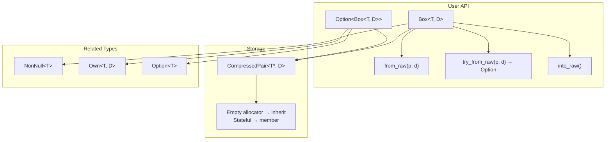

# box.h — Non-Null Owning Smart Pointer

## Introduction

`box.h` provides `Box<T, Allocator>`, a non-null owning smart pointer with a Rust-style API. Unlike `Own<T>` which is nullable, `Box<T>` is **guaranteed non-null by construction** — no default constructor, no `reset()`, no null state.

A partial specialization `Option<Box<T, Allocator>>` enables niche optimization: `nullptr` encodes `None`, so `sizeof(Option<Box<T>>) == sizeof(T*)` — matching Rust's `Option<Box<T>>`.

## Design Philosophy

1. **Non-null at the type level.** `Box<T>` deletes the default constructor. Construction from a null raw pointer panics in debug. This eliminates an entire class of null-dereference bugs.

2. **EBO via CompressedPair.** `CompressedPair<T, Allocator>` uses private inheritance for empty allocators to achieve zero storage overhead — `sizeof(Box<T, GlobalAllocator>) == sizeof(T*)`.

3. **Niche optimization for Option<Box\<T\>\>.** The `Option<Box<T>>` specialization stores a single `CompressedPair`; `nullptr` means `None`. No bool tag, no wasted bytes — matches Rust exactly.

4. **Covariant construction.** `Box<Derived, A>` implicitly moves into `Box<Base, A>` (and `Option<Box<Base, A>>`) when the pointer and allocator are convertible — matching `std::unique_ptr`'s behavior.

5. **Move-only with a "husk" state.** Post-move, the source holds `nullptr` internally. This violates the public invariant but is hidden — the only valid operation on a moved-from `Box` is destruction (which guards on null). This matches `std::unique_ptr`'s post-move contract.

## Architecture



## API Reference

### Box\<T, Allocator\>

| Member | Description |
| --- | --- |
| `static from_raw(T*, Allocator)` | Wrap raw pointer. Debug-asserts non-null. |
| `static try_from_raw(T*, Allocator)` | Checked: returns `Option<Box>` (`None` if null). |
| `T* get()` | Raw pointer access. |
| `T& operator*()` | Dereference (SFINAE-removed for `T = void`). |
| `T* operator->()` | Member access (SFINAE-removed for `T = void`). |
| `Allocator& allocator()` | Access the allocator. |
| `NonNull<T> as_nonnull()` | Non-owning non-null view. |
| `T* into_raw() &&` | Relinquish ownership (consuming, rvalue only). |

Deleted: default ctor, copy ctor, copy assignment.

### Option\<Box\<T, Allocator\>\>

Asymmetric `unwrap()`: `const&` returns `T*` (borrow), `&&` returns `Box<T>` (consume). Combinators pass `NonNull<T>` to callbacks on `const&` and `Box<T>&&` on `&&`.

| Member | Returns `const&` | Returns `&&` |
| --- | --- | --- |
| `unwrap()` | `T*` | `Box<T>` |
| `unwrap_unchecked()` | `T*` | `Box<T>` |
| `map(fn)` | `Option<U>` | `Option<U>` |
| `and_then(fn)` | `Option<R>` | `Option<R>` |
| `filter(pred)` | — | `Option<Box<T>>` |

## Usage Examples

### Basic ownership

```cpp
auto raw = new Connection("localhost:8080");
auto box = xpp::Box<Connection>::from_raw(raw);
box->send("hello");
// box.into_raw() release; or let destructor run
```

### Checked construction (nullable source)

```cpp
Connection* maybe = pool.acquire();
auto opt = xpp::Box<Connection>::try_from_raw(maybe);
opt.inspect([](auto conn) { conn->send("acquired"); });
// If maybe was null, opt is None — no panic, no UB.
```

### Covariant move

```cpp
xpp::Box<FileStream> derived = xpp::Box<FileStream>::from_raw(new FileStream);
xpp::Box<Stream>     base    = std::move(derived);  // implicit upcast
```

### Option\<Box\> combinators

```cpp
auto maybe_box = xpp::Box<int>::try_from_raw(raw);
auto doubled = std::move(maybe_box)
    .map([](auto nn) { return *nn * 2; })   // nn is NonNull<int>
    .unwrap_or(0);
```

### Custom allocator

```cpp
struct FreeAlloc {
    void operator()(void* p) const noexcept { free(p); }
};
void* buf = malloc(4096);
auto box = xpp::Box<void, FreeAlloc>::from_raw(
    buf, FreeAlloc{});
// sizeof(Box<void, FreeAlloc>) == sizeof(void*)  (FreeAlloc is empty → EBO)
```

## Compile-Time Size Guarantees

```cpp
static_assert(sizeof(Box<int>) == sizeof(int*));
static_assert(sizeof(Option<Box<int>>) == sizeof(int*));
```

## Comparison

| Feature | xpp::Box\<T\> | std::unique_ptr\<T\> | Rust Box\<T\> |
| --- | --- | --- | --- |
| sizeof | `sizeof(T*)` | `sizeof(T*)` (default deleter) | `sizeof(T*)` |
| Non-null | Guaranteed (no default ctor) | Nullable (default ctor) | Guaranteed |
| Move-only | Yes | Yes | Yes |
| Custom allocator | `Allocator` template param | `Deleter` template param | `A: Allocator` |
| Allocator storage | `CompressedPair` (EBO when empty) | EBO (empty-base optimization) | In `Box` (ZST = 0 bytes) |
| Deallocation | `~T()` + `alloc.deallocate()` (separated) | `deleter(ptr)` (single call) | `drop` + `dealloc` |
| Covariant | `Box<Derived, A>` → `Box<Base, A>` (same A) | `unique_ptr<Derived, D>` → `unique_ptr<Base, D>` | Via `DerefMut` trait |
| Niche Option | Yes (`Option<Box<T>> = ptr`) | No | `Option<Box<T>> = ptr` |
| EBO | Yes (`CompressedPair`) | Via empty-base optimization | N/A (ZST, no EBO needed) |
| Post-move | `nullptr` husk (dtor guards) | `nullptr` (dtor guards) | Consumed (no husk) |

## Implementation Notes

### CompressedPair

Two specializations based on whether the allocator is empty and non-final:

```cpp
// Empty + non-final → inherit privately (EBO)
template <class T, class D> struct CompressedPair<T, D, true> : private D {
    T* p;
};

// Stateful → store as member
template <class T, class D> struct CompressedPair<T, D, false> {
    T* p;
    D  d;
};
```

`__is_final` detection supports C++11 toolchains that lack `std::is_final` (C++14). On truly ancient toolchains, the check degrades to "assume not final" — a size-not-correctness issue.

### Option\<Box\> Niche Optimization

```cpp
template <class T, class Allocator>
class Option<Box<T, Allocator>> {
    CompressedPair<T, Allocator> m_storage;
};
```

`Option<Box<T>>` stores the same `CompressedPair<T*, Allocator>` as `Box<T>`. `nullptr` in `m_storage.p` represents `None`. Since `Box` guarantees non-null, `nullptr` is free to repurpose. No bool tag — `sizeof(Option<Box<int>>) == sizeof(int*)`.

The asymmetric `unwrap()` is necessary because `Box` is move-only: `const&` cannot move out, so it returns `T*` (a borrow). `&&` consumes the Option and returns `Box<T>` by move.

### Post-move husk

After `Box(Box&&)` or `Option<Box>(Box&&)`, the source's `m_storage.p` is set to `nullptr`. The destructor guards:

```cpp
~Box() {
    if (m_storage.p) m_storage.allocator()(m_storage.p);
}
```

This allows the defaulted move operations (no custom cleanup needed for the source) while keeping size minimal.
