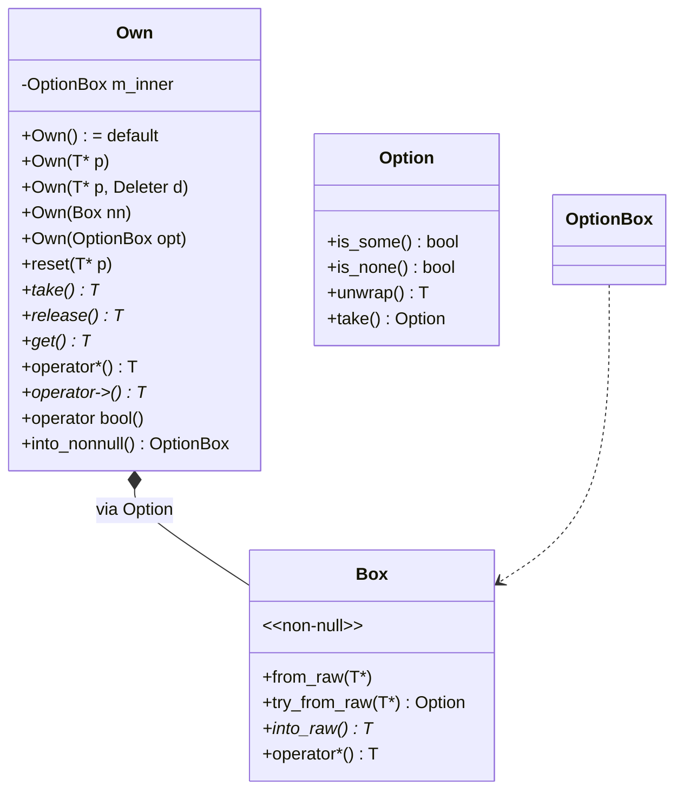

# own.h — Nullable Owning Smart Pointer

## Introduction

`own.h` provides `Own<T, Alloc>`, a move-only nullable owning smart pointer. It is the libxpp counterpart of `std::unique_ptr<T>`, with a Rust-style API surface and first-class integration with `Box<T>` and `Option<Box<T>>`.

The design bridges two worlds:

- **Rust-like ownership** — `take()` releases ownership (like `Option::take`), `into_nonnull()` converts to `Option<Box<T>>` for combinator usage.
- **C++ RAII** — `reset()`, `release()`, `operator*`, `operator->`, `get()`, `operator bool` all work as expected.

At rest, `Own<T>` is `sizeof(T*)` when using the default `GlobalAllocator` (empty-base optimization eliminates the allocator storage).

## Design Philosophy

1. **Nullable by default.** `Own<T>` can be null — default-constructed, moved-from, or assigned `nullptr`. Use `if (own)` to check. If you need a type-level guarantee of non-null, use `Box<T>` directly.

2. **Box\<T\> as the foundation.** `Own<T>` is implemented as `Option<Box<T, Alloc>>`. The `Box<T>` type is non-null by construction; wrapping it in `Option` adds the null state. This means all `Own<T>` operations ultimately delegate to `Box<T>` for resource management.

3. **Alloc via EBO.** The default `GlobalAllocator` is an empty class. C++ empty-base optimization (EBO) collapses it to zero size, so `sizeof(Own<T>) == sizeof(T*)`. Stateful allocators add their own size.

4. **Covariant construction.** `Own<Derived, Alloc>` implicitly converts to `Own<Base, Alloc>` (if the pointer is convertible). Same `Alloc` required — different `Alloc` types would have different `CompressedPair` layouts.

5. **Void specialization.** `Own<void>` stores a raw pointer without `operator*` or `operator->`. Useful for opaque handles where only `reset()` and `get()` matter. SFINAE removes the dereference operators when `T = void`. The destructor calls `deallocate(ptr, Layout{0,1})` (no `~T()` for void).

## Architecture



**Own\<T\> is `Option<Box<T>>`. That's the whole implementation.**

## API Reference

### Construction

| Expression | Result |
|---|---|
| `Own<T> o;` | Empty (null) |
| `Own<T> o(nullptr);` | Empty (null) |
| `Own<T> o(p);` | Owns raw pointer `p` (null → empty) |
| `Own<T> o(p, alloc);` | Owns `p` with custom allocator |
| `Own<T> o(std::move(box));` | Adopts from non-null `Box<T>` |
| `Own<T> o(std::move(opt));` | Adopts from `Option<Box<T>>` |
| `Own<Base, A>(std::move(derived_own));` | Covariant: `Derived*` → `Base*` (same `A`) |

### Mutation

| Method | Description |
|---|---|
| `reset(T* p = nullptr)` | Delete old, own new (null → empty) |
| `release()` | Relinquish ownership, return raw pointer |
| `take()` | Same as `release()` — Rust-style name |
| `operator=(nullptr)` | Reset to empty |

### Access

| Method | Returns | On empty |
|---|---|---|
| `get()` | `T*` | `nullptr` |
| `operator*()` | `T&` | Debug assert; UB in release |
| `operator->()` | `T*` | Debug assert; UB in release |
| `operator bool()` | `bool` (explicit) | — |
| `operator==(nullptr)` | `bool` | — |
| `operator!=(nullptr)` | `bool` | — |

### Bridge to Rust-style

| Method | Returns | Description |
|---|---|---|
| `into_nonnull()` | `Option<Box<T, A>>&&` (rvalue only) | Consume Own, get nullable Box |

To access the allocator, unwrap to `Box` first: `std::move(own).into_nonnull().unwrap().allocator()`. `Own` itself doesn't expose `allocator()` because an empty `Own` has no inner `Box` and thus no allocator instance.

## Usage Examples

### Basic ownership

```cpp
xpp::Own<Connection> conn(new Connection("localhost:8080"));
if (conn) {
    conn->send("hello");
}
// Automatically deleted when `conn` goes out of scope.
```

### Release and re-wrap

```cpp
xpp::Own<Buffer> buf = allocate();

// Hand raw pointer to a C API...
c_api_process(buf.release());  // buf is now empty

// ...re-wrap the result from C API
void* raw = c_api_get_result();
buf.reset(static_cast<Buffer*>(raw));
```

### Custom allocator

```cpp
struct FileAlloc {
  void deallocate(void *p, xpp::Layout) const noexcept {
    if (p) fclose(static_cast<FILE*>(p));
  }
};
xpp::Own<FILE, FileAlloc> file(fopen("data.txt", "r"), FileAlloc{});
// `FileAlloc::deallocate` called on destruction or reset.
// sizeof(Own<FILE, FileAlloc>) == sizeof(FILE*) + sizeof(FileAlloc) (EBO if empty)
```

### Covariant adoption

```cpp
xpp::Own<FileStream> stream = open_file_stream("data.bin");
xpp::Own<Stream>     base   = std::move(stream);  // implicit upcast (same Alloc)
base->read(buf, len);
// Own<Base> destructor calls ~FileStream() then GlobalAllocator::deallocate.
```

### Bridge to Option\<Box\<T\>\> for combinators

```cpp
xpp::Own<int> maybe_own = compute_value();

// Convert to Option<Box<int>> and use Option combinators:
auto result = std::move(maybe_own).into_nonnull()
              .map([](auto &box) { return *box * 2; })
              .unwrap_or(0);
```

### Opaque void handles

```cpp
// Own<void> has no operator* or operator-> — just get/reset/release.
xpp::Own<void> handle(platform_create_window());
platform_draw(handle.get());
// ~Own<void> calls GlobalAllocator::deallocate (which calls ::operator delete).
```

## Comparison

| | `xpp::Own<T>` | `std::unique_ptr<T>` | Rust `Option<Box<T>>` |
|---|---|---|---|
| Nullable | Yes (default) | Yes (default) | Yes (via Option) |
| Move-only | Yes | Yes | Yes |
| Release/take | `take()` / `release()` | `release()` | `Option::take` + `Box::into_raw` |
| Custom allocator | Template parameter (`Alloc`) | Template parameter (`Deleter`) | `Box<T, A>` where A: Allocator |
| Covariant | `Own<Derived, A>` → `Own<Base, A>` | `unique_ptr<Derived>` → `unique_ptr<Base>` | Via trait objects only |
| Into Rust path | `into_nonnull() -> Option<Box<T>>` | N/A | Built-in |
| Void support | Yes (SFINAE on `*` / `->`) | Yes (specialization) | `Box<dyn Any>` |
| Size (default) | `sizeof(T*)` | `sizeof(T*)` | `sizeof(T*)` |
| Debug assert on null deref | Yes (`XPP_DEBUG_ASSERT`) | No (UB) | Panic |

## Implementation Notes

### Storage

```cpp
template <class T, class Alloc = GlobalAllocator>
class Own {
  using Inner = Option<Box<T, Alloc>>;
  Inner m_inner;
};
```

`Own<T>` is a thin wrapper around `Option<Box<T, Alloc>>`. Every operation maps to a corresponding `Option` or `Box` operation:

| Own operation | Underlying |
|---|---|
| `Own(T* p)` | `Box<T>::try_from_raw(p)` → `Option<Box<T>>` |
| `reset(p)` | `m_inner = Box<T>::try_from_raw(p)` |
| `take()` | `m_inner.take().unwrap_unchecked().into_raw()` |
| `operator*()` | `m_inner.unwrap_unchecked().operator*()` |
| `if (own)` | `m_inner.is_some()` |
| `into_nonnull()` | `std::move(m_inner)` |

### Empty-Base Optimization

```cpp
static_assert(sizeof(Own<int>) == sizeof(int*),
              "Own<T, GlobalAllocator> must be sizeof(T*)");
```

`GlobalAllocator` is stateless (empty class). The compiler applies EBO via `CompressedPair`, so `Box<T, GlobalAllocator>` has no extra storage cost beyond `T*`, and `Option<Box<T>>` (which uses `aligned_storage`) also collapses to `sizeof(T*)`.

Stateful allocators (custom allocators with members) add their size on top. If the allocator itself is empty (stateless struct), EBO applies again — `sizeof(Own<T, EmptyAlloc>) == sizeof(T*)`.

### Destruction

The destructor calls `~T()` explicitly, then `alloc.deallocate(ptr, Layout::of<T>())` — separating object destruction from memory deallocation, matching Rust's `Allocator` trait. For `T = void`, `~T()` is skipped (tag dispatch) and `Layout{0, 1}` is used as a sentinel.

### SFINAE on operator* / operator->

```cpp
template <class U = T,
          class = typename std::enable_if<!std::is_void<U>::value>::type>
U& operator*() const noexcept;
```

When `T = void`, the `enable_if` fails and the compiler removes the overload from the candidate set. This avoids hard errors while keeping the API clean — `Own<void>` simply doesn't expose dereference.

### Covariance

The covariant constructor uses a `friend` declaration to access `m_inner` of another instantiation:

```cpp
template <class U,
          class = typename std::enable_if<
              std::is_convertible<U*, T*>::value &&
              !std::is_same<U, T>::value>::type>
Own(Own<U, Alloc> &&other) noexcept : m_inner(std::move(other.m_inner)) {}

template <class, class> friend class Own;
```

Two constraints gate the conversion: pointer convertibility (Derived* → Base*) and non-identity (not Own<T> → Own<T>). Same `Alloc` required — different `Alloc` types would have different `CompressedPair` layouts. The `friend` declaration is necessary because `Own<U, Alloc>::m_inner` is private to that instantiation.

### Default vs debug

`operator*` and `operator->` only check in debug builds (`XPP_DEBUG_ASSERT`). This is intentional: the cost of a null check on every pointer dereference is rarely acceptable in release builds. The contract is that callers must ensure non-null via `if (own)` or structural proof before dereferencing — exactly the same contract as `unique_ptr::operator*`.
