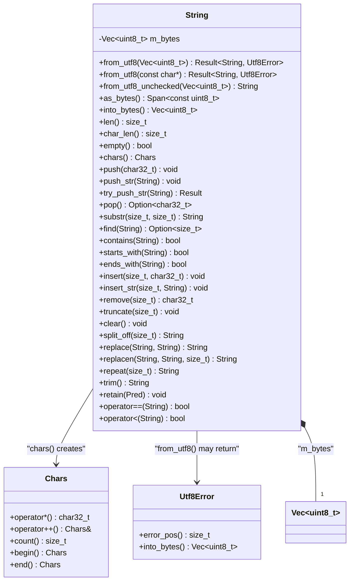

# string.h — UTF-8 String

## Introduction

`string.h` provides `xpp::String`, a heap-allocated UTF-8 string backed by `Vec<uint8_t>`. It guarantees valid UTF-8 at the type level — `const String&` means "valid Unicode text", while `Vec<uint8_t>` means "opaque bytes".

Key differences from `std::string`:

- **Validated UTF-8.** Construction validates; mutation preserves the invariant. `from_utf8()` returns `Result` on invalid input.
- **Code point iteration.** `chars()` yields `char32_t`, decoding multi-byte sequences transparently.
- **Dual OOM API.** `push()` asserts on OOM; `try_push_str()` returns `Result<void, AllocError>`.
- **`Option` returns.** `pop()` returns `Option<char32_t>` — no UB on empty strings.
- **`Vec<uint8_t>` storage.** Shares the same allocator protocol as `Vec<T>`, enabling `split_off()`, `retain()`, `shrink_to_fit()`, and `try_reserve()`.

## Design Philosophy

1. **Valid UTF-8 is a type-level invariant.** The constructor validates; `push()`, `insert()`, and `pop()` preserve it. There is no way to get invalid bytes into a `String` without `from_utf8_unchecked()` (which is call-by-call UB).

2. **Byte storage, code point interface.** Internally `Vec<uint8_t>`, externally `char32_t`. The type system enforces the boundary — `as_bytes()` gives raw bytes, `chars()` gives decoded code points.

3. **Substring on code point boundaries.** `substr()`, `truncate()`, `split_off()`, `insert()`, and `remove()` assert that offsets land on code point boundaries — never slicing a multi-byte character in half.

4. **No Unicode tables in L0.** Validation, encoding, and decoding use tiny state machines (~50 lines total). Normalization, case folding, and grapheme clusters belong in a future `libxpp-ext/unicode` extension.

5. **C++11, header-only.** No `<string>` dependency — `Vec<uint8_t>` replaces `std::vector<uint8_t>`. No `requires`, `consteval`, or `if constexpr`.

## Architecture



## API Reference

### Construction

| Expression | Result |
|---|---|
| `String s;` | Empty, zero allocation |
| `String s(capacity);` | Pre-allocated capacity, empty |
| `String::from_utf8(bytes)` | Validates, takes ownership → `Result<String, Utf8Error>` |
| `String::from_utf8("hello")` | C-string, copies + validates |
| `String::from_utf8(data, len)` | Buffer, copies + validates |
| `String::from_utf8_unchecked(bytes)` | No validation — caller guarantees valid UTF-8 |
| Copy / Move | Default — deep copy or ownership transfer |

### Views

| Method | Returns | Notes |
|---|---|---|
| `as_bytes()` | `Span<const uint8_t>` | O(1), no copy |
| `into_bytes()` | `Vec<uint8_t>` | Consuming, O(1) move |

### Length / Capacity

| Method | Returns | Notes |
|---|---|---|
| `len()` | `size_t` | Byte count, O(1) |
| `char_len()` | `size_t` | Code point count, O(n) |
| `empty()` | `bool` | `len() == 0` |
| `capacity()` | `size_t` | Allocated byte capacity, O(1) |
| `reserve(n)` | `void` | Assert on OOM |
| `try_reserve(n)` | `Result<void, AllocError>` | Explicit error |
| `shrink_to_fit()` | `void` | Assert on OOM |
| `try_shrink_to_fit()` | `Result<void, AllocError>` | Explicit error |

### Element Access

| Method | Returns | On Out-of-Bounds / Empty |
|---|---|---|
| `pop()` | `Option<char32_t>` | Returns `None` if empty |
| `substr(offset, count)` | `String` | Asserts on CP boundaries |
| `chars()` | `Chars` | Code point iterator |

### Mutation

| Method | Returns | Notes |
|---|---|---|
| `push(cp)` | `void` | Encodes 1–4 bytes, asserts on OOM + invalid CP |
| `push_str(s)` | `void` | Byte append, asserts on OOM |
| `try_push_str(s)` | `Result<void, AllocError>` | Explicit OOM |
| `push_str("hi")` | `void` | C-string convenience |
| `insert(byte_pos, cp)` | `void` | O(n), CP boundary assert |
| `insert_str(byte_pos, s)` | `void` | O(n) |
| `remove(byte_pos)` | `char32_t` | O(n), CP boundary assert |
| `truncate(new_len)` | `void` | CP boundary assert |
| `clear()` | `void` | Preserves capacity |
| `split_off(byte_pos)` | `String` | O(tail length), CP boundary assert |

### Search

| Method | Returns | Notes |
|---|---|---|
| `find(pattern)` | `Option<size_t>` | Byte-level `memmem`, O(n*m) |
| `rfind(pattern)` | `Option<size_t>` | Reverse scan |
| `contains(pattern)` | `bool` | `find(p).is_some()` |
| `starts_with(prefix)` | `bool` | Prefix match |
| `ends_with(suffix)` | `bool` | Suffix match |

### Utility

| Method | Returns | Notes |
|---|---|---|
| `replace(from, to)` | `String` | All occurrences, returns new String |
| `replacen(from, to, n)` | `String` | Capped count |
| `repeat(n)` | `String` | Concatenate n times |
| `trim()` | `String` | Remove ASCII whitespace (0x09–0x0D, 0x20) |
| `trim_start()` | `String` | Leading whitespace only |
| `trim_end()` | `String` | Trailing whitespace only |
| `retain(pred)` | `void` | Keep CPs where pred(cp) is true |

### Comparison

| Method | Notes |
|---|---|
| `operator==` / `!=` | Byte-wise equality |
| `operator<` | Byte-wise lexicographic |
| `operator==(const char*)` | C-string comparison |

## Usage Examples

### Construction and validation

```cpp
// From a C-string — copies and validates
auto r = String::from_utf8("hello世界");
if (r.is_ok()) {
    String s = r.unwrap();
    fmt::print("len={} chars={}\n", s.len(), s.char_len());
    // → len=11 chars=7
}

// From raw bytes — validates, returns error on failure
Vec<uint8_t> bytes = read_from_network();
auto r2 = String::from_utf8(std::move(bytes));

// Unchecked — caller guarantees validity
Vec<uint8_t> data = ...;
String s = String::from_utf8_unchecked(std::move(data));
```

### Code point iteration

```cpp
String s = String::from_utf8("a你🎉").unwrap();

for (char32_t cp : s.chars()) {
    fmt::print("U+{:04X}\n", static_cast<uint32_t>(cp));
}
// → U+0061, U+4F60, U+1F389

// Manual loop
auto it = s.chars();
auto end = it.end();
while (it != end) {
    char32_t cp = *it;
    ++it;
}
```

### Push and pop

```cpp
String s;
s.push('a');
s.push(0x4F60);  // 你
s.push(0x1F389); // 🎉

auto last = s.pop();  // Option<char32_t>: Some(🎉)
s.push_str(" world");
```

### Substring and split

```cpp
String s = String::from_utf8("你好世界").unwrap();

// "你好" = first 6 bytes (你=3, 好=3)
String first_two = s.substr(0, 6);  // "你好"

// Split at character boundary
String tail = s.split_off(6);
// s    == "你好"
// tail == "世界"
```

### Search

```cpp
String s = String::from_utf8("hello xpp world").unwrap();

auto pos = s.find(String::from_utf8("xpp").unwrap());
// pos == Some(6)

if (s.contains("xpp")) { ... }
if (s.starts_with("hello")) { ... }
if (s.ends_with("world")) { ... }
```

### Filter with retain

```cpp
String s = String::from_utf8("a1b2c3").unwrap();

// Keep only ASCII letters
s.retain([](char32_t cp) { return cp >= 'a' && cp <= 'z'; });
// s == "abc"
```

## Comparison

| | `xpp::String` | `std::string` | Rust `String` |
|---|---|---|---|
| Encoding | Guaranteed UTF-8 | Byte string (any encoding) | Guaranteed UTF-8 |
| Internal storage | `Vec<uint8_t>` (xpp allocator) | SSO + heap (std allocator) | `Vec<u8>` (global allocator) |
| `pop()` | `Option<char32_t>` (value recovered) | `pop_back()` → void (value lost) | `Option<char>` (value recovered) |
| `chars()` | Code point iterator → `char32_t` | N/A (manual decoding) | `Chars` iterator → `char` |
| Validation | `from_utf8()` → `Result` | Never | Type-level guarantee |
| OOM handling | Dual API: assert / `Result` | Throws `std::bad_alloc` | Aborts |
| `split_off()` | Yes (reuses Vec::split_off) | No | Yes |
| `retain()` | Yes (code-point level) | `erase(remove_if(...))` | Yes |
| `trim()` | ASCII-only (`0x09-0x0D`, `0x20`) | N/A | Unicode whitespace |
| C++ standard | C++11 | C++98 | — |

## Implementation Notes

### Validation

Single-pass scan with a ~50 line state machine. Checks:
- Continuation bytes must be `10xxxxxx`
- Overlong encodings (e.g. U+002F encoded as 2 bytes)
- Surrogate halves (U+D800–U+DFFF)
- Beyond U+10FFFF

No lookup tables. No dependencies beyond `<cstdint>`.

### Delegating to Vec

Since internal storage is `Vec<uint8_t>`, capacity methods are one-liner delegations:

```cpp
size_t String::len()       const noexcept { return m_bytes.len(); }
size_t String::capacity()  const noexcept { return m_bytes.capacity(); }
void   String::clear()                   { m_bytes.clear(); }
void   String::reserve(size_t n)         { m_bytes.reserve(n); }
```

`split_off()` delegates to `Vec::split_off()` with a code point boundary check. `try_reserve()` and `try_shrink_to_fit()` delegate directly.

### Chars iterator

`Chars` is a forward input iterator. `begin()` returns a copy of the current position; `end()` returns a sentinel with `m_pos == m_end`. Range-for support via instance `begin()`/`end()` — no static sentinel needed.

### bytes_eq helper

Comparisons use a private `bytes_eq()` loop instead of `memcmp()` to avoid macOS C++11 C library compatibility issues.

### No `<string>` dependency

The header does not include `<string>`. `into_std_string()` is omitted — users who need `std::string` can construct one from `as_bytes()`:

```cpp
String s = ...;
std::string ss(reinterpret_cast<const char*>(s.as_bytes().data()), s.len());
```
