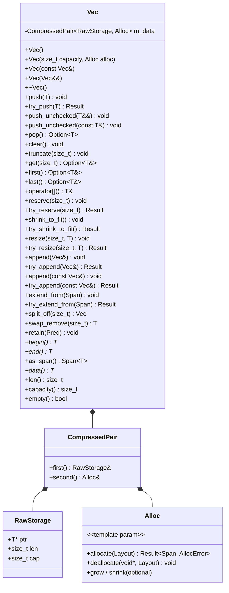

# vec.h — Contiguous Growable Array

## Introduction

`vec.h` provides `Vec<T, Alloc>`, a heap-allocated contiguous growable array. It replaces `std::vector<T>` in all xpp-owned code paths and closely mirrors **Rust's `std::vec::Vec`** in both API design and ownership semantics.

Key differences from `std::vector`:

- **Dual API for every growth path.** `push()` / `reserve()` / `resize()` assert on OOM; `try_push()` / `try_reserve()` / `try_resize()` return `Result<void, AllocError>` for explicit error handling.
- **`first()` / `last()` return `Option<T&>`.** No undefined behavior on empty containers — `None` is a first-class answer.
- **`pop()` returns `Option<T>`.** Moving the last element out, not just destroying it. The value is consumed, not lost.
- **Allocator-aware.** Accepts an optional `Alloc` template parameter using xpp's allocator protocol (`allocate` / `deallocate` / `grow` / `shrink`). EBO via `CompressedPair` means `sizeof(Vec<T, GlobalAllocator>)` = 24 bytes (3 words).

## Design Philosophy

1. **Explicit OOM, no exceptions.** Every growth path has two forms: a convenience form that `XPP_ASSERT`s on failure (`push`, `reserve`, `resize`, `shrink_to_fit`, `append`), and an explicit `try_*` form that returns `Result<void, AllocError>`. Callers choose their trust level — crash-fast in debug, or handle gracefully in production paths.

2. **Option for nullable access.** `get(i)`, `first()`, `last()`, and `pop()` all return `Option`. The type system encodes the possibility of "nothing there" without runtime assertions or undefined behavior. `operator[]` remains unchecked (debug-assert only) for hot-loop performance, use `get()` when index validity is uncertain.

3. **Growth: double, minimum 4.** On push-without-capacity, the buffer grows by `max(capacity * 2, 4)`. The minimum ensures small Vecs don't thrash on reallocation (`0 → 4 → 8 → 16 → ...`). Growth uses `default_grow()` (allocate + memcpy + deallocate) which the allocator may override with an in-place `realloc`.

4. **Move semantics with cleanup.** Move constructor and move assignment steal the buffer and leave the source in a valid empty state (`ptr = nullptr, len = 0, cap = 0`). The moved-from Vec is safely destructible and reusable.

5. **C++11 compatible, header-only.** No `requires`, `consteval`, or `if constexpr`. Template parameter defaults and `CompressedPair` enable zero-overhead allocator storage without C++17 features.

## Architecture



**The buffer at a glance:**

```
┌──────────────────────┬──────────────────────────────┐
│     initialized      │       uninitialized          │
│     [0 .. len)       │     [len .. capacity)        │
├──────────────────────┼──────────────────────────────┤
│ T, T, T, T, T        │ ????????????????????????????  │
└──────────────────────┴──────────────────────────────┘
        ptr                                              ptr + capacity
```

Elements in `[0, len)` are live objects with properly constructed `T` values. Elements in `[len, capacity)` are raw uninitialized memory — no constructors have run, no destructors will run. `push()` placement-news into the gap; `pop()` destructs the last element and decrements `len`.

## API Reference

### Construction

| Expression | Result |
|---|---|
| `Vec<T> v;` | Empty, capacity 0, GlobalAllocator |
| `Vec<T> v(alloc);` | Empty, custom allocator |
| `Vec<T> v(capacity);` | Pre-allocated with GlobalAllocator |
| `Vec<T> v(capacity, alloc);` | Pre-allocated with custom allocator |
| `Vec<T> v(other);` | Copy — deep clones all elements |
| `Vec<T> v(std::move(other));` | Move — steals buffer, source becomes empty |

### Capacity

| Method | Returns | Notes |
|---|---|---|
| `len()` | `size_t` | Number of live elements |
| `capacity()` | `size_t` | Allocated slots (>= len) |
| `empty()` | `bool` | `len() == 0` |
| `reserve(n)` | `void` | Asserts on OOM |
| `try_reserve(n)` | `Result<void, AllocError>` | Allocates space for `len() + n` elements |
| `shrink_to_fit()` | `void` | Asserts on OOM |
| `try_shrink_to_fit()` | `Result<void, AllocError>` | Releases excess capacity |

### Element Access

| Method | Returns | On Out-of-Bounds / Empty |
|---|---|---|
| `operator[](i)` | `T&` | Debug assert; UB in release |
| `get(i)` | `Option<T&>` | Returns `None` |
| `first()` | `Option<T&>` | Returns `None` if empty |
| `last()` | `Option<T&>` | Returns `None` if empty |
| `data()` | `T*` | `nullptr` if empty |
| `as_span()` | `Span<T>` | Zero-length span if empty |

### Mutation

| Method | Returns | Notes |
|---|---|---|
| `push(v)` | `void` | Copy, asserts on OOM |
| `push(T&& v)` | `void` | Move, asserts on OOM |
| `try_push(v)` | `Result<void, AllocError>` | Copy, explicit error |
| `try_push(T&& v)` | `Result<void, AllocError>` | Move, explicit error |
| `push_unchecked(T&& v)` / `push_unchecked(const T& v)` | `void` | Debug-asserts `len < cap`; no grow |
| `pop()` | `Option<T>` | Returns `None` if empty; destructs element |
| `clear()` | `void` | Destructs all elements, `len = 0`, preserves capacity |
| `truncate(n)` | `void` | Destructs elements `[n, len)`, `len = n` |

### Bulk Operations

| Method | Returns | Notes |
|---|---|---|
| `resize(n, fill)` | `void` | Asserts on OOM |
| `try_resize(n, fill)` | `Result<void, AllocError>` | Grow: construct fill; shrink: truncate |
| `append(other)` | `void` | Moves all elements from `other`, leaves it empty |
| `try_append(other)` | `Result<void, AllocError>` | Explicit error variant |
| `append(const Vec&)` | `void` | Copies all elements from `other` without consuming it |
| `try_append(const Vec&)` | `Result<void, AllocError>` | Explicit error variant |
| `extend_from(span)` | `void` | Copies all elements from `Span<const T>` |
| `try_extend_from(span)` | `Result<void, AllocError>` | Explicit error variant |
| `split_off(at)` | `Vec` | Moves `[at, len)` into a new Vec, truncates `this` |
| `swap_remove(i)` | `T` | Replaces `[i]` with last element, returns old `[i]`; O(1) |
| `retain(pred)` | `void` | Keeps elements where `pred(x)` is true; preserves order |

### Iteration

| Method | Returns |
|---|---|
| `begin()` | `T*` |
| `end()` | `T*` (one past last element) |
| `begin() const` | `const T*` |
| `end() const` | `const T*` |

Iterators are raw pointers — compatible with C++11 range-for and STL algorithms.

### Allocator Access

| Method | Returns |
|---|---|
| `allocator()` | `Alloc&` |
| `allocator() const` | `const Alloc&` |

## Usage Examples

### Basic push / pop

```cpp
xpp::Vec<int> v;
v.push(42);
v.push(7);
v.push(99);

// Access
int a = v[0];                    // 42
auto first = v.first();          // Option<int&>: Some(42)
auto last  = v.last();           // Option<int&>: Some(99)
auto oob   = v.get(100);         // Option<int&>: None

// Pop
auto x = v.pop();                // Option<int>: Some(99)
// v is now {42, 7}
```

### Empty container safety

```cpp
xpp::Vec<int> empty;
assert(empty.pop().is_none());   // None, not UB
assert(empty.first().is_none()); // None, not UB
assert(empty.last().is_none());  // None, not UB
assert(empty.get(0).is_none());  // None, not UB
```

### Explicit error handling

```cpp
xpp::Vec<LargeObject> v;
auto r = v.try_push(LargeObject{...});
if (r.is_err()) {
    // OOM — degrade gracefully
    return xpp::err(AllocError{});
}
```

### Reserve + unchecked push (hot path)

```cpp
xpp::Vec<int> v;
v.reserve(1000);  // one allocation
for (int i = 0; i < 1000; i++) {
    v.push_unchecked(i);  // no capacity check, no grow
}
```

### Bulk copy from a span

```cpp
int raw[] = {10, 20, 30, 40, 50};
xpp::Vec<int> v;
v.extend_from(xpp::Span<const int>(raw, 5));
// v == [10, 20, 30, 40, 50]
```

### split_off

```cpp
xpp::Vec<int> v;
v.push(1); v.push(2); v.push(3); v.push(4);

auto tail = v.split_off(2);
// v    == {1, 2}
// tail == {3, 4}
```

### swap_remove (fast unordered removal)

```cpp
xpp::Vec<std::string> v;
v.push("a"); v.push("b"); v.push("c");

auto removed = v.swap_remove(0);  // removes "a", swaps "c" to position 0
// v == {"c", "b"}   (order not preserved!)
```

### retain (in-place filter)

```cpp
xpp::Vec<int> v;
v.push(1); v.push(2); v.push(3); v.push(4);

v.retain([](int x) { return x % 2 == 0; });
// v == {2, 4}
```

### Range-for iteration

```cpp
xpp::Vec<int> v;
v.push(1); v.push(2); v.push(3);

for (auto& x : v) {
    x *= 2;
}
// v == {2, 4, 6}

// Const iteration:
const auto& cv = v;
for (const auto& x : cv) {
    printf("%d\n", x);
}
```

### Copy and move

```cpp
xpp::Vec<int> a;
a.push(1); a.push(2);

xpp::Vec<int> b(a);              // deep copy
xpp::Vec<int> c(std::move(a));   // move: a is now empty, c owns the buffer

a = b;                            // copy assignment
a = std::move(b);                 // move assignment
```

### Custom allocator

```cpp
struct CountingAlloc {
    size_t allocs = 0;
    size_t frees  = 0;

    xpp::Result<xpp::Span<uint8_t>, xpp::AllocError>
    allocate(xpp::Layout layout) const {
        void* p = ::operator new(layout.size);
        if (!p) return xpp::err(xpp::AllocError{});
        const_cast<CountingAlloc*>(this)->allocs++;
        return xpp::ok(xpp::Span<uint8_t>(static_cast<uint8_t*>(p), layout.size));
    }

    void deallocate(void* ptr, xpp::Layout) const noexcept {
        const_cast<CountingAlloc*>(this)->frees++;
        ::operator delete(ptr);
    }
};

CountingAlloc ca;
{
    xpp::Vec<int, CountingAlloc> v(ca);
    v.push(1);
    v.push(2);
    assert(v.allocator().allocs >= 1);
}
// ca.frees reflects deallocation
```

## Comparison

| | `xpp::Vec<T, Alloc>` | `std::vector<T, Alloc>` | Rust `Vec<T>` |
|---|---|---|---|
| `push()` on OOM | `XPP_ASSERT` | Throws `std::bad_alloc` | Aborts |
| Explicit OOM | `try_push()` → `Result` | `try_emplace_back` (C++26) | `try_reserve()` + `push` |
| `pop()` | `Option<T>` (move out) | `void` (destructs, value lost) | `Option<T>` (move out) |
| `get(i)` | `Option<T&>` | — | `get(i)` → `Option<&T>` |
| `first()` / `last()` | `Option<T&>` | `front()` / `back()` → `T&` (UB if empty) | `first()` / `last()` → `Option<&T>` |
| Allocator storage | EBO (`CompressedPair`) | EBO (implementation-defined) | Global only |
| Growth strategy | Double, min 4 | 2x or 1.5x (impl-defined) | Double, min 4 |
| `swap_remove` | Yes (O(1) unordered) | No | Yes |
| `split_off` | Yes | No | Yes |
| `retain` | Yes | `erase(remove_if(...), ...)` | Yes |
| Iterator type | Raw `T*` | Wrapper class | Raw pointer or slice iter |
| C++ standard | C++11 | C++98 | — |

## Implementation Notes

### Storage: CompressedPair

```cpp
template <class T, class Alloc>
class Vec {
    _::CompressedPair<RawStorage, Alloc> m_data;

    struct RawStorage {
        T*     ptr;   // heap buffer
        size_t len;   // initialized elements
        size_t cap;   // allocated slots
    };
};
```

`CompressedPair` applies EBO: when `Alloc` is empty (like `GlobalAllocator`), `m_data` is exactly `RawStorage` (24 bytes). When `Alloc` is stateful, it grows by `sizeof(Alloc)`.

### Accessor methods for CompressedPair fields

Rather than storing `m_len` and `m_cap` as reference members (which would bloat `sizeof(Vec)`), the implementation uses private accessor methods that return references into `m_data.first()`:

```cpp
size_t& len_() { return m_data.first().len; }
size_t& cap_() { return m_data.first().cap; }
```

These are inlined by the compiler — zero runtime cost, clean `sizeof`.

### Growth: default_grow and default_shrink

`grow_to()` delegates to `default_grow(allocator, ptr, old_layout, new_layout)`, which is:
1. Allocate new buffer (`allocator.allocate(new_layout)`)
2. `memcpy` old elements to new buffer
3. Deallocate old buffer (`allocator.deallocate(ptr, old_layout)`)

`try_shrink_to_fit()` uses `default_shrink()` instead of `grow_to()` because `grow_to()` short-circuits when `new_cap <= capacity()` — which is always true for a shrink operation. `default_shrink()` unconditionally reallocates to the smaller size.

For allocators with native `realloc` (e.g. jemalloc, tcmalloc), overriding `grow()` and `shrink()` avoids the intermediate copy.

### Placement-new construction and explicit destruction

All element construction uses placement-new:
```cpp
::new (ptr() + len()) T(value);   // push
::new (ptr() + len()) T(std::move(value));  // push (rvalue)
```

Destruction is explicit (never `delete`):
```cpp
ptr()[i].~T();   // individual
destroy_range(begin_idx, end_idx);  // batch
```

`dealloc_buffer()` calls `allocator.deallocate()` on the raw memory — it does NOT call destructors. The caller must have already destroyed all live elements.

### No const T

A `static_assert(!std::is_const<T>::value, ...)` prevents `Vec<const int>` — a vector of immutable elements is semantically nonsensical (you can't move out of const, can't grow by copying const, etc.).

### Omitted methods

- **`into_raw_parts()` / `from_raw_parts()`** — `data()` + `len()` + `capacity()` already expose the same information. The consuming/reconstruction semantics add no capability in C++ (no FFI boundary to cross).
- **`first_mut()` / `last_mut()`** — C++ distinguishes mutable vs const access via `const`-qualification on the member function, not via separate method names.
- **`get_many_mut([i, j])`** — Requires compile-time proof that the two indices are distinct. C++ cannot express this safely without runtime checks.
