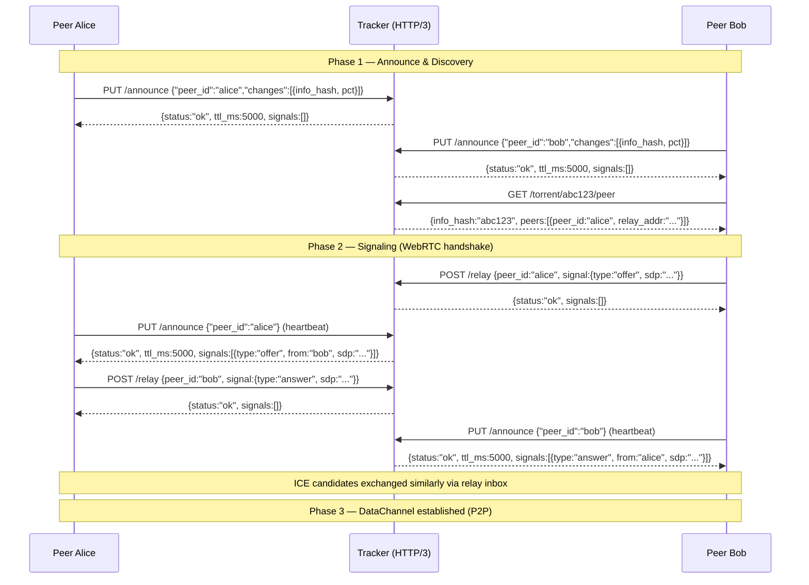

## ADDED Requirements

### Protocol overview



---

### Requirement: PUT /announce — Peer announce (heartbeat)

#### Request fields

| Field | Type | Required | Description |
|-------|------|----------|-------------|
| `peer_id` | string | yes | Peer identifier (max 32 bytes) |
| `changes` | array of `{info_hash, pct}` | optional | Files to upsert or update. `info_hash` 40-char hex. `pct` in [0.0, 100.0]. `pct: 0.0` removes the peer from this file. |

A body with only `peer_id` is a pure heartbeat — no file list changes, just refresh TTL.

#### Response fields (200)

| Field | Type | Description |
|-------|------|-------------|
| `status` | string | `"ok"` |
| `ttl_ms` | integer | Server-assigned keep-alive interval. Peer MUST send next PUT within this time, or be pruned. |
| `signals` | array | Pending signaling messages for this peer. Empty array if none. |

`signals` entry format:

| Field | Type | Description |
|-------|------|-------------|
| `type` | string | `"offer"`, `"answer"`, or `"candidate"` |
| `from` | string | Sender peer_id |
| `sdp` | string | SDP body (for offer/answer) |
| `candidate` | string | ICE candidate string (for candidate) |
| `sdpMid` | string | Media stream ID (for candidate) |
| `sdpMLineIndex` | integer | Media line index (for candidate) |

#### Scenarios

- **Pure heartbeat**: `PUT /announce {"peer_id":"alice"}` — body has only peer_id. Server refreshes TTL without modifying file lists.
- **Incremental update**: `PUT /announce {"peer_id":"alice","changes":[{"info_hash":"abc123","pct":45.7}]}` — registers alice as having abc123 at 45.7%.
- **Remove file**: `PUT /announce {"peer_id":"alice","changes":[{"info_hash":"old987","pct":0.0}]}` — removes alice from file old987's peer list.
- **Inbox delivery**: `signals` in the response SHALL contain all pending signals for this peer. An empty array means none pending.
- **Dynamic TTL**: Server MAY adjust `ttl_ms` in the response based on load. Peer SHALL re-schedule its timer to the new interval.

---

### Requirement: GET /torrent/:info_hash/peer — Peer discovery

#### Response fields (200)

| Field | Type | Description |
|-------|------|-------------|
| `info_hash` | string | The requested info_hash |
| `peers` | array of `{peer_id, relay_addr}` | Active peers for this file. Empty array if no peers. |

`peers` entry format:

| Field | Type | Description |
|-------|------|-------------|
| `peer_id` | string | The peer's identifier |
| `relay_addr` | string | `"host:port"` of the Tracker instance this peer is registered with (for signaling via `POST /relay`) |

`relay_addr` is filled by the server from its own configuration — not from the peer. The discovering peer uses this address to send signaling messages to the target peer via `POST /relay`.

#### Scenarios

- **Peers found**: Returns all active peers registered for the file.
- **No peers**: Returns `{"info_hash":"abc123","peers":[]}` with status 200.
- **Stale peers excluded**: Peers that exceeded their TTL are removed before the response is built.

---

### Requirement: POST /relay — Signaling relay

#### Request fields

| Field | Type | Required | Description |
|-------|------|----------|-------------|
| `peer_id` | string | yes | Target peer_id for the signal message |
| `signal` | object | yes | The signal to relay |

`signal` fields:

| Field | Type | Description |
|-------|------|-------------|
| `type` | string | `"offer"`, `"answer"`, or `"candidate"` |
| `from` | string | Sender peer_id |
| `sdp` | string | SDP body (offer/answer) |
| `candidate` | string | ICE candidate string (candidate) |
| `sdpMid` | string | Media stream ID (candidate) |
| `sdpMLineIndex` | integer | Media line index (candidate) |

#### Response fields (200)

| Field | Type | Description |
|-------|------|-------------|
| `status` | string | `"ok"` |
| `signals` | array | Sender's own pending inbox signals (same format as PUT response) |

#### Scenarios

- **Offer relay**: Sender enqueues offer in target peer's inbox. Target receives it on next `PUT /announce`.
- **Answer relay**: Same flow. Sender receives own inbox in response.
- **ICE candidate relay**: Same flow for ICE candidates.
- **Sender inbox**: The `signals` field in the response returns the sender's pending inbox — same as PUT response — so the sender gets any pending signals in the same round-trip.
- **Signal TTL**: Signals expire after server-configured TTL (default 30s). Expired signals are dropped silently.
- **Target peer unreachable**: If the target peer is unknown, an empty inbox is created. The signal is enqueued. If the peer registers within the TTL, it will receive the signal. If not, the signal expires silently.

---

### Requirement: POST /torrent — Publish torrent

Publish a `.torrent` file to the Tracker. The seeder posts the raw bencoded torrent. The Tracker computes `info_hash` = SHA1(bencode(info)) and indexes the torrent by it.

#### Request

- `Content-Type: application/octet-stream`
- Body: raw bencoded `.torrent` file

#### Response fields (200)

| Field | Type | Description |
|-------|------|-------------|
| `status` | string | `"ok"` |
| `info_hash` | string | Computed info_hash (40-char hex) |

#### Errors

| Status | `error` | Scenario |
|--------|---------|----------|
| 400 | `bad_request` | Body is not valid bencoding |
| 400 | `bad_request` | Missing required info fields |
| 413 | `too_large` | Torrent exceeds max size (default 1 MB) |

#### Scenarios

- **Publish new torrent**: Seeder posts valid bencoded torrent → 200 with computed `info_hash`. Subsequent `GET /torrent/<info_hash>` returns the torrent.
- **Republish same torrent**: Posting a torrent with identical info dict → 200 with same `info_hash` (idempotent).

---

### Requirement: GET /torrent/:info_hash — Retrieve torrent

Retrieve a `.torrent` file by `info_hash` (40-char lowercase hex).

#### Response (200)

- `Content-Type: application/octet-stream`
- Body: raw bencoded `.torrent` file

#### Errors

| Status | `error` | Scenario |
|--------|---------|----------|
| 400 | `bad_request` | info_hash not exactly 40 hex characters |
| 404 | `not_found` | No torrent published for this info_hash |

#### Scenarios

- **Retrieve existing torrent**: `GET /torrent/a1b2c3...` for a published torrent → 200 with raw bencoded body.
- **Torrent not found**: `GET /torrent/a1b2c3...` for an unpublished torrent → 404.

---

### Requirement: GET /health — Health check

#### Response fields (200)

| Field | Type | Description |
|-------|------|-------------|
| `status` | string | `"ok"` |
| `uptime_ms` | integer | Server uptime in milliseconds |
| `peer_count` | integer | Active peer count |
| `file_count` | integer | Tracked file count |

---

### Requirement: GET /stats — Global statistics

#### Response fields (200)

| Field | Type | Description |
|-------|------|-------------|
| `peer_count` | integer | Total active peers |
| `file_count` | integer | Total tracked files |
| `seed_count` | integer | Peers with pct == 100.0 |
| `leech_count` | integer | Peers with pct < 100.0 |

---

### Requirement: TTL-based lifecycle

The server assigns a per-peer TTL via `ttl_ms` in PUT responses. The peer MUST send the next PUT within this interval. If the peer exceeds TTL: the cleanup sweep (every 1000ms) removes the peer from all registered files and drops its inbox. The server MAY adjust `ttl_ms` dynamically based on load. The server SHALL NOT push notifications to peers — all communication is client-initiated.

#### Common errors

| Status | `error` value | Scenario |
|--------|--------------|----------|
| 400 | `bad_request` | Missing required field, invalid `pct`, invalid field type |
| 404 | `not_found` | Info_hash not found |
| 429 | `rate_limited` | More than 60 requests from a single IP in 1 second |
| 500 | `internal` | Unexpected server error |

---

## ADDED Requirements — Peer Protocol (DataChannel)

### Overview

After WebRTC connection setup (ICE/DTLS handshake via Tracker relay), peers communicate over reliable ordered DataChannels. Each DataChannel is labeled by `info_hash` (40-char hex) and carries exactly one torrent's transfer.

### Message format

All messages share an 8-byte fixed header followed by a variable-length payload. The header is self-describing and transport-agnostic (works over WebRTC DataChannel, raw UDP, or any ordered/unordered byte stream).

```
 0                   1                   2                   3
 0 1 2 3 4 5 6 7 8 9 0 1 2 3 4 5 6 7 8 9 0 1 2 3 4 5 6 7 8 9 0 1
+-+-+-+-+-+-+-+-+-+-+-+-+-+-+-+-+-+-+-+-+-+-+-+-+-+-+-+-+-+-+-+-+
|  ver  |  cmd  |              seq              |    reserved   |
+-+-+-+-+-+-+-+-+-+-+-+-+-+-+-+-+-+-+-+-+-+-+-+-+-+-+-+-+-+-+-+-+
|            length             |                               |
+-+-+-+-+-+-+-+-+-+-+-+-+-+-+-+-+                               |
|                                                               |
|                    payload (length bytes)                     |
|                                                               |
+-+-+-+-+-+-+-+-+-+-+-+-+-+-+-+-+-+-+-+-+-+-+-+-+-+-+-+-+-+-+-+-+
```

| Field | Offset | Size | Description |
|-------|--------|------|-------------|
| version | 0 | 4 bit | Protocol version, current = 0 |
| cmd | 0 | 4 bit | Message type (see table below) |
| seq | 1–2 | 2B LE | Monotonic message sequence number, shared counter across all commands |
| reserved | 3 | 1B | Reserved, MUST be 0 |
| length | 4–6 | 3B LE | Payload length in bytes, max 16 MiB (0 = no payload) |
| payload | 8+ | length bytes | Command-specific body |

**Header = 8 bytes.** All multi-byte fields are little-endian. The fixed 8-byte header ensures natural alignment and makes parsing uniform across transports.

| Tag | Name | Direction | Payload |
|-----|------|-----------|---------|
| `0x01` | `hello_req` | bidirectional | `[20B info_hash][N bytes peer_id]` — handshake + heartbeat |
| `0x02` | `hello_rsp` | bidirectional | `[20B info_hash][N bytes peer_id]` — ack |
| `0x03` | `bitfield_req` | → | `[4B block_count LE][N bytes bitmap]` — my bitmap |
| `0x04` | `bitfield_rsp` | ← | `[4B block_count LE][N bytes bitmap]` — your bitmap |
| `0x05` | `block_req` | → | `[4B block_index LE][2B start_piece LE][2B count LE]` |
| `0x06` | `block_rsp` | ← | `[4B block_index LE][2B start_piece LE][N bytes data]` |
| `0x07` | `have_req` | bidirectional | `[4B block_index LE]` — notification, no response |
| `0x08` | `bye_req` | bidirectional | (empty) — half-close, wait for bye_rsp or timeout |
| `0x09` | `bye_rsp` | bidirectional | (empty) — ack, then close DataChannel |

All multi-byte integers are little-endian. Bitmaps use `xBitmap` from `xbase` — the raw bytes from `xBitmapData()` form the `N bytes bitmap` payload.

### Requirement: hello_req / hello_rsp — Handshake and heartbeat

`hello_req` serves dual purpose: initial handshake validation and periodic heartbeat (default 30s interval). When a DataChannel becomes ready, the initiator SHALL send `hello_req` first. The receiver SHALL validate `info_hash` matches the expected value. Mismatch SHALL cause the DataChannel to close.

`hello_rsp` is the response, carrying the same payload. Both sides validate the other's `info_hash`.

#### Scenario: Valid handshake

- **WHEN** receiving `hello_req{info_hash == expected, peer_id}`
- **THEN** respond with `hello_rsp{info_hash, peer_id}`
- **THEN** immediately send `bitfield_req` with own block bitmap

#### Scenario: Info_hash mismatch

- **WHEN** receiving `hello_req{info_hash != expected}` or `hello_rsp{info_hash != expected}`
- **THEN** close the DataChannel without further communication

### Requirement: bitfield_req / bitfield_rsp — BitField exchange

The `bitfield_req` message carries the sender's complete block bitmap. `bitfield_rsp` carries the responder's bitmap. After exchange, both peers know each other's available blocks.

- `bit[i] = 1` → peer has block `i` and can serve it
- `bit[i] = 0` → peer does not have block `i`

The raw bytes from `xBitmapData(bitfield, &nbytes)` form the `N bytes bitmap` payload. The receiver SHALL `memcpy` the payload into its own `xBitmap` for the peer.

Block count is sent as a 4-byte LE integer to allow the receiver to validate bitmap size: `N = ceil(block_count / 8)`.

#### Scenario: Exchange bitfields

- **WHEN** receiving `hello_rsp` (handshake complete)
- **THEN** send `bitfield_req{block_count, my_bitmap}`
- **WHEN** receiving `bitfield_req`
- **THEN** validate `len(bitmap) == ceil(block_count / 8)`
- **THEN** store sender's bitmap in peer state, transition peer to ACTIVE
- **THEN** respond with `bitfield_rsp{block_count, my_bitmap}`

#### Scenario: bitfield with zero blocks known

- **WHEN** a peer has no blocks (just started downloading)
- **THEN** SHALL still send bitfield with `block_count` and all-zero bitmap
- **THEN** other peers know this peer is present but not yet seeding

### Requirement: Block request and transfer

Block transfer uses piece-level granularity. A block (`block_length` bytes, default 256KB) is divided into pieces (`piece_size` bytes, fixed 16KB):

A `block_req` asks for one or more consecutive pieces within a block. Only one message per request. SHALL only request pieces from peers whose bitfield indicates they have the block.

#### block_req fields

| Field | Size | Description |
|-------|------|-------------|
| `block_index` | 4B LE | Which block |
| `start_piece` | 2B LE | First piece index within the block (0 ≤ start_piece < pieces_per_block) |
| `count` | 2B LE | Number of consecutive pieces to request |

#### block_rsp fields

| Field | Size | Description |
|-------|------|-------------|
| `block_index` | 4B LE | Which block |
| `start_piece` | 2B LE | First piece index, matching the request |
| `data` | N bytes | Raw block data, length = count × piece_size |

#### Scenario: Request pieces

- **WHEN** sending `block_req{block_index=5, start_piece=2, count=3}` to a peer with block 5
- **THEN** the peer SHALL respond with `block_rsp{block_index=5, start_piece=2, data=<3×16KB>}`
- **THEN** the requesting peer SHALL feed data into SHA1 context and cache write

#### Scenario: Request for missing block

- **WHEN** a peer receives a Request for a block it does not have
- **THEN** the peer SHALL ignore the Request (no error response)
- **THEN** the requesting peer SHALL detect the stall and retry with another peer

#### Scenario: Block SHA1 verification

- **WHEN** all pieces of a block are received
- **THEN** compute SHA1 of the assembled block and compare against `block_hashes[block_index]`
- **THEN** on match: mark block complete, send have to all other peers, notify scheduler
- **THEN** on mismatch: discard block data, retry up to 3 times, then report failure

### Requirement: have_req — Progress notification

When a peer successfully verifies a block (SHA1 match), it SHALL send `have_req{block_index}` to all other ACTIVE peers. No response is expected.

#### Scenario: Receive have_req

- **WHEN** receiving `have_req{block_index}` from a peer
- **THEN** set `peer.bitfield[block_index] = 1` via `xBitmapSet`
- **THEN** if there are pending pieces waiting for this block, attempt dispatch to this peer

### Requirement: bye_req / bye_rsp — Graceful disconnect

`bye_req` initiates graceful shutdown. The sender enters half-close: no more `block_req` may be sent, but in-flight `block_rsp` messages are still accepted. The receiver SHALL clean up pending requests and reply with `bye_rsp`, then close the DataChannel. If `bye_rsp` is not received within `bye_timeout_ms` (default 5s), the sender SHALL close the DataChannel directly.

### Requirement: In-flight request limit

A peer SHALL NOT send more than `max_reqs_per_peer` (default 4) unacknowledged `block_req` messages to a single peer. A peer SHALL NOT send a `block_req` for a block the target peer does not have (per its bitfield).

### Requirement: Request timeout

If a `block_req` does not receive a `block_rsp` within `request_timeout_ms` (default 30s), the piece SHALL be re-assigned to another peer if available. The timed-out peer's `reqs_pending` SHALL be decremented.
