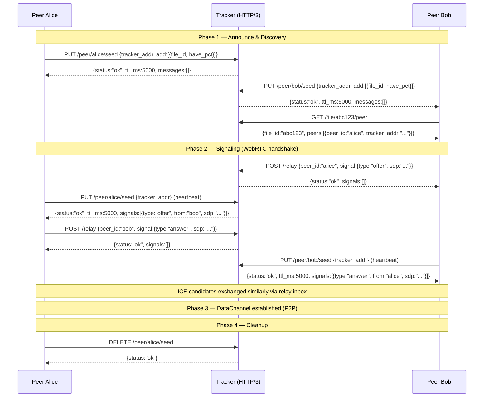

## ADDED Requirements

### Protocol overview

---

### Requirement: PUT /peer/:peer_id/seed — Seed announce (heartbeat)

#### Request fields

| Field | Type | Required | Description |
|-------|------|----------|-------------|
| `tracker_addr` | string | first PUT | `"host:port"` of the peer's Tracker instance. Required on initial announce; retained by server on subsequent heartbeats. |
| `add` | array of `{file_id, have_pct}` | optional | Files to upsert or update. `file_id` max 64 chars. `have_pct` in [0.0, 100.0]. |
| `del` | array of `{file_id}` | optional | Files to remove. Each entry is `{"file_id": "..."}`. |

#### Response fields (200)

| Field | Type | Description |
|-------|------|-------------|
| `status` | string | `"ok"` |
| `ttl_ms` | integer | Server-assigned keep-alive interval. Peer MUST send next PUT within this time, or be pruned. |
| `signals` | array | Pending signaling messages for this peer. Empty array if none. |

`signals` entry format:

| Field | Type | Description |
|-------|------|-------------|
| `type` | string | `"offer"`, `"answer"`, or `"candidate"` |
| `from` | string | Sender peer_id |
| `to` | string | Recipient peer_id (implied by inbox ownership) |
| `sdp` | string | SDP body (for offer/answer) |
| `candidate` | string | ICE candidate string (for candidate) |
| `sdpMid` | string | Media stream ID (for candidate) |
| `sdpMLineIndex` | integer | Media line index (for candidate) |

#### Scenarios

- **Pure heartbeat**: `PUT /peer/alice/seed {}` — body is empty. Server refreshes TTL without modifying file lists.
- **Incremental add**: `PUT /peer/alice/seed {"add":[{"file_id":"abc123","have_pct":45.7}]}` — registers alice as having abc123 at 45.7%.
- **Incremental del**: `PUT /peer/alice/seed {"del":[{"file_id":"old987"}]}` — removes alice from file old987's peer list.
- **Mixed update**: `PUT` with both `add` and `del` in the same request — processed atomically.
- **Inbox delivery**: `signals` in the response SHALL contain all pending signals for this peer. An empty array means none pending.
- **Dynamic TTL**: Server MAY adjust `ttl_ms` in the response based on load. Peer SHALL re-schedule its timer to the new interval.

---

### Requirement: DELETE /peer/:peer_id/seed — Graceful departure

#### Request

No body.

#### Response fields (200)

| Field | Type | Description |
|-------|------|-------------|
| `status` | string | `"ok"` |

#### Response fields (404)

| Field | Type | Description |
|-------|------|-------------|
| `error` | string | `"not_found"` |
| `message` | string | Human-readable description |

#### Scenarios

- **Peer leaves**: Removes the peer from ALL registered files. Drops inbox. Returns 200.
- **Unknown peer**: Returns 404 with `{"error":"not_found","message":"peer alice not registered"}`.

---

### Requirement: GET /file/:file_id/peer — Peer discovery

#### Response fields (200)

| Field | Type | Description |
|-------|------|-------------|
| `file_id` | string | The requested file_id |
| `peers` | array of `{peer_id, tracker_addr}` | Active peers for this file. Empty array if no peers. |

`peers` entry format:

| Field | Type | Description |
|-------|------|-------------|
| `peer_id` | string | The peer's identifier |
| `tracker_addr` | string | `"host:port"` of the peer's Tracker instance (for signaling via `POST /relay`) |

#### Scenarios

- **Peers found**: Returns all active peers registered for the file.
- **No peers**: Returns `{"file_id":"abc123","peers":[]}` with status 200.
- **Stale peers excluded**: Peers that exceeded their TTL are removed before the response is built.

---

### Requirement: POST /relay — Signaling relay

#### Request fields

| Field | Type | Required | Description |
|-------|------|----------|-------------|
| `peer_id` | string | yes | Target peer_id for the signal message |
| `signal` | object | yes | The signal to relay |

`signal` fields:

| Field | Type | Description |
|-------|------|-------------|
| `type` | string | `"offer"`, `"answer"`, or `"candidate"` |
| `from` | string | Sender peer_id |
| `to` | string | Recipient peer_id |
| `sdp` | string | SDP body (offer/answer) |
| `candidate` | string | ICE candidate string (candidate) |
| `sdpMid` | string | Media stream ID (candidate) |
| `sdpMLineIndex` | integer | Media line index (candidate) |

#### Response fields (200)

| Field | Type | Description |
|-------|------|-------------|
| `status` | string | `"ok"` |
| `signals` | array | Sender's own pending inbox signals (same format as PUT response) |

#### Scenarios

- **Offer relay**: Sender enqueues offer in target peer's inbox. Target receives it on next `PUT /peer/:peer_id/seed`.
- **Answer relay**: Same flow. Sender receives own inbox in response.
- **ICE candidate relay**: Same flow for ICE candidates.
- **Sender inbox**: The `signals` field in the response returns the sender's pending inbox — same as PUT response — so the sender gets any pending signals in the same round-trip.
- **Signal TTL**: Signals expire after server-configured TTL (default 30s). Expired signals are dropped silently.
- **Target peer unreachable**: If the target peer is unknown, an empty inbox is created. The signal is enqueued. If the peer registers within the TTL, it will receive the signal. If not, the signal expires silently.

---

### Requirement: GET /health — Health check

#### Response fields (200)

| Field | Type | Description |
|-------|------|-------------|
| `status` | string | `"ok"` |
| `uptime_ms` | integer | Server uptime in milliseconds |
| `peer_count` | integer | Active peer count |
| `file_count` | integer | Tracked file count |

---

### Requirement: GET /stats — Global statistics

#### Response fields (200)

| Field | Type | Description |
|-------|------|-------------|
| `peer_count` | integer | Total active peers |
| `file_count` | integer | Total tracked files |
| `seed_count` | integer | Peers with have_pct == 100.0 |
| `leech_count` | integer | Peers with have_pct < 100.0 |

---

### Requirement: TTL-based lifecycle

The server assigns a per-peer TTL via `ttl_ms` in PUT responses. The peer MUST send the next PUT within this interval. If the peer exceeds TTL: the cleanup sweep (every 1000ms) removes the peer from all registered files and drops its inbox. The server MAY adjust `ttl_ms` dynamically based on load. The server SHALL NOT push notifications to peers — all communication is client-initiated.

#### Common errors

| Status | `error` value | Scenario |
|--------|--------------|----------|
| 400 | `bad_request` | Missing required field, invalid `have_pct`, invalid field type |
| 404 | `not_found` | Peer or file not found (DELETE) |
| 429 | `rate_limited` | More than 60 requests from a single IP in 1 second |
| 500 | `internal` | Unexpected server error |
