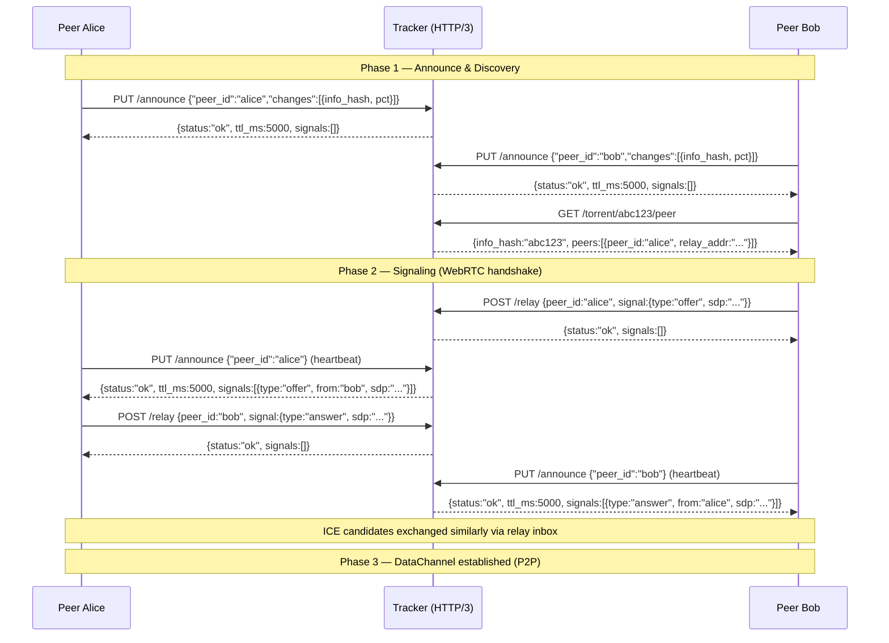

## ADDED Requirements

### Protocol overview

---

### Requirement: PUT /announce — Peer announce (heartbeat)

#### Request fields

| Field | Type | Required | Description |
|-------|------|----------|-------------|
| `peer_id` | string | yes | Peer identifier (max 32 bytes) |
| `changes` | array of `{info_hash, pct}` | optional | Files to upsert or update. `info_hash` 40-char hex. `pct` in [0.0, 100.0]. `pct: 0.0` removes the peer from this file. |

A body with only `peer_id` is a pure heartbeat — no file list changes, just refresh TTL.

#### Response fields (200)

| Field | Type | Description |
|-------|------|-------------|
| `status` | string | `"ok"` |
| `ttl_ms` | integer | Server-assigned keep-alive interval. Peer MUST send next PUT within this time, or be pruned. |
| `signals` | array | Pending signaling messages for this peer. Empty array if none. |

`signals` entry format:

| Field | Type | Description |
|-------|------|-------------|
| `type` | string | `"offer"`, `"answer"`, or `"candidate"` |
| `from` | string | Sender peer_id |
| `sdp` | string | SDP body (for offer/answer) |
| `candidate` | string | ICE candidate string (for candidate) |
| `sdpMid` | string | Media stream ID (for candidate) |
| `sdpMLineIndex` | integer | Media line index (for candidate) |

#### Scenarios

- **Pure heartbeat**: `PUT /announce {"peer_id":"alice"}` — body has only peer_id. Server refreshes TTL without modifying file lists.
- **Incremental update**: `PUT /announce {"peer_id":"alice","changes":[{"info_hash":"abc123","pct":45.7}]}` — registers alice as having abc123 at 45.7%.
- **Remove file**: `PUT /announce {"peer_id":"alice","changes":[{"info_hash":"old987","pct":0.0}]}` — removes alice from file old987's peer list.
- **Inbox delivery**: `signals` in the response SHALL contain all pending signals for this peer. An empty array means none pending.
- **Dynamic TTL**: Server MAY adjust `ttl_ms` in the response based on load. Peer SHALL re-schedule its timer to the new interval.

---

### Requirement: GET /torrent/:info_hash/peer — Peer discovery

#### Response fields (200)

| Field | Type | Description |
|-------|------|-------------|
| `info_hash` | string | The requested info_hash |
| `peers` | array of `{peer_id, relay_addr}` | Active peers for this file. Empty array if no peers. |

`peers` entry format:

| Field | Type | Description |
|-------|------|-------------|
| `peer_id` | string | The peer's identifier |
| `relay_addr` | string | `"host:port"` of the Tracker instance this peer is registered with (for signaling via `POST /relay`) |

`relay_addr` is filled by the server from its own configuration — not from the peer. The discovering peer uses this address to send signaling messages to the target peer via `POST /relay`.

#### Scenarios

- **Peers found**: Returns all active peers registered for the file.
- **No peers**: Returns `{"info_hash":"abc123","peers":[]}` with status 200.
- **Stale peers excluded**: Peers that exceeded their TTL are removed before the response is built.

---

### Requirement: POST /relay — Signaling relay

#### Request fields

| Field | Type | Required | Description |
|-------|------|----------|-------------|
| `peer_id` | string | yes | Target peer_id for the signal message |
| `signal` | object | yes | The signal to relay |

`signal` fields:

| Field | Type | Description |
|-------|------|-------------|
| `type` | string | `"offer"`, `"answer"`, or `"candidate"` |
| `from` | string | Sender peer_id |
| `sdp` | string | SDP body (offer/answer) |
| `candidate` | string | ICE candidate string (candidate) |
| `sdpMid` | string | Media stream ID (candidate) |
| `sdpMLineIndex` | integer | Media line index (candidate) |

#### Response fields (200)

| Field | Type | Description |
|-------|------|-------------|
| `status` | string | `"ok"` |
| `signals` | array | Sender's own pending inbox signals (same format as PUT response) |

#### Scenarios

- **Offer relay**: Sender enqueues offer in target peer's inbox. Target receives it on next `PUT /announce`.
- **Answer relay**: Same flow. Sender receives own inbox in response.
- **ICE candidate relay**: Same flow for ICE candidates.
- **Sender inbox**: The `signals` field in the response returns the sender's pending inbox — same as PUT response — so the sender gets any pending signals in the same round-trip.
- **Signal TTL**: Signals expire after server-configured TTL (default 30s). Expired signals are dropped silently.
- **Target peer unreachable**: If the target peer is unknown, an empty inbox is created. The signal is enqueued. If the peer registers within the TTL, it will receive the signal. If not, the signal expires silently.

---

### Requirement: POST /torrent — Publish torrent

Publish a `.torrent` file to the Tracker. The seeder posts the raw bencoded torrent. The Tracker computes `info_hash` = SHA1(bencode(info)) and indexes the torrent by it.

#### Request

- `Content-Type: application/octet-stream`
- Body: raw bencoded `.torrent` file

#### Response fields (200)

| Field | Type | Description |
|-------|------|-------------|
| `status` | string | `"ok"` |
| `info_hash` | string | Computed info_hash (40-char hex) |

#### Errors

| Status | `error` | Scenario |
|--------|---------|----------|
| 400 | `bad_request` | Body is not valid bencoding |
| 400 | `bad_request` | Missing required info fields |
| 413 | `too_large` | Torrent exceeds max size (default 1 MB) |

#### Scenarios

- **Publish new torrent**: Seeder posts valid bencoded torrent → 200 with computed `info_hash`. Subsequent `GET /torrent/<info_hash>` returns the torrent.
- **Republish same torrent**: Posting a torrent with identical info dict → 200 with same `info_hash` (idempotent).

---

### Requirement: GET /torrent/:info_hash — Retrieve torrent

Retrieve a `.torrent` file by `info_hash` (40-char lowercase hex).

#### Response (200)

- `Content-Type: application/octet-stream`
- Body: raw bencoded `.torrent` file

#### Errors

| Status | `error` | Scenario |
|--------|---------|----------|
| 400 | `bad_request` | info_hash not exactly 40 hex characters |
| 404 | `not_found` | No torrent published for this info_hash |

#### Scenarios

- **Retrieve existing torrent**: `GET /torrent/a1b2c3...` for a published torrent → 200 with raw bencoded body.
- **Torrent not found**: `GET /torrent/a1b2c3...` for an unpublished torrent → 404.

---

### Requirement: GET /health — Health check

#### Response fields (200)

| Field | Type | Description |
|-------|------|-------------|
| `status` | string | `"ok"` |
| `uptime_ms` | integer | Server uptime in milliseconds |
| `peer_count` | integer | Active peer count |
| `file_count` | integer | Tracked file count |

---

### Requirement: GET /stats — Global statistics

#### Response fields (200)

| Field | Type | Description |
|-------|------|-------------|
| `peer_count` | integer | Total active peers |
| `file_count` | integer | Total tracked files |
| `seed_count` | integer | Peers with pct == 100.0 |
| `leech_count` | integer | Peers with pct < 100.0 |

---

### Requirement: TTL-based lifecycle

The server assigns a per-peer TTL via `ttl_ms` in PUT responses. The peer MUST send the next PUT within this interval. If the peer exceeds TTL: the cleanup sweep (every 1000ms) removes the peer from all registered files and drops its inbox. The server MAY adjust `ttl_ms` dynamically based on load. The server SHALL NOT push notifications to peers — all communication is client-initiated.

#### Common errors

| Status | `error` value | Scenario |
|--------|--------------|----------|
| 400 | `bad_request` | Missing required field, invalid `pct`, invalid field type |
| 404 | `not_found` | Info_hash not found |
| 429 | `rate_limited` | More than 60 requests from a single IP in 1 second |
| 500 | `internal` | Unexpected server error |
